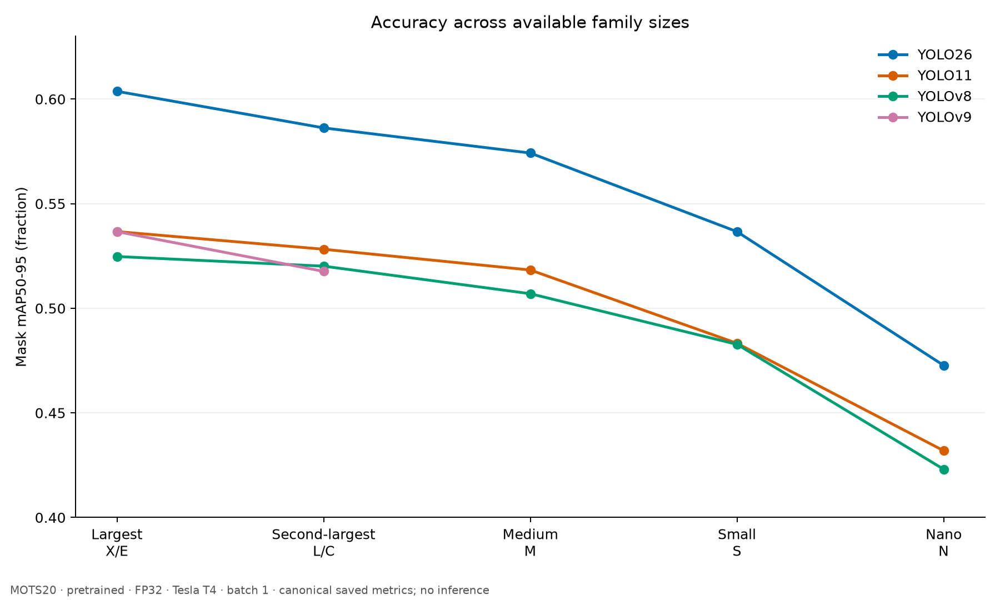
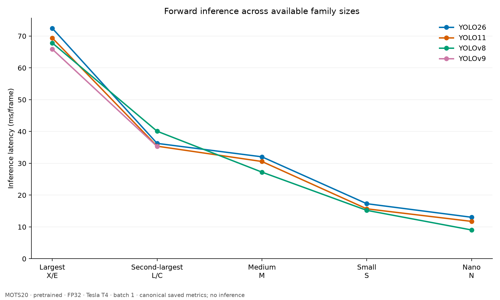
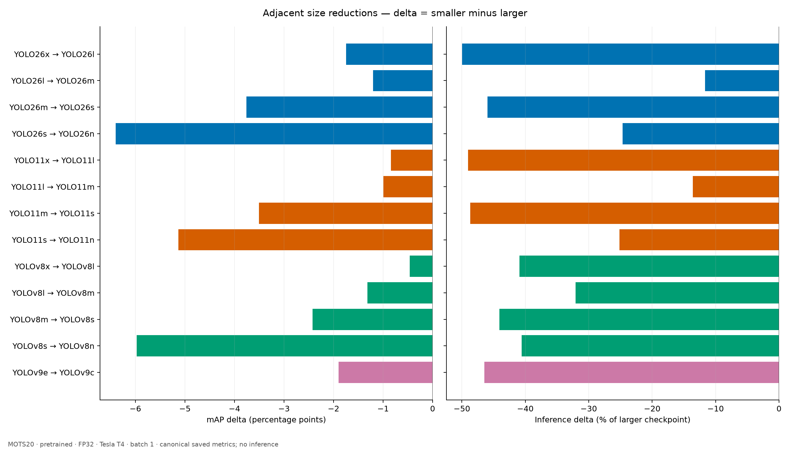
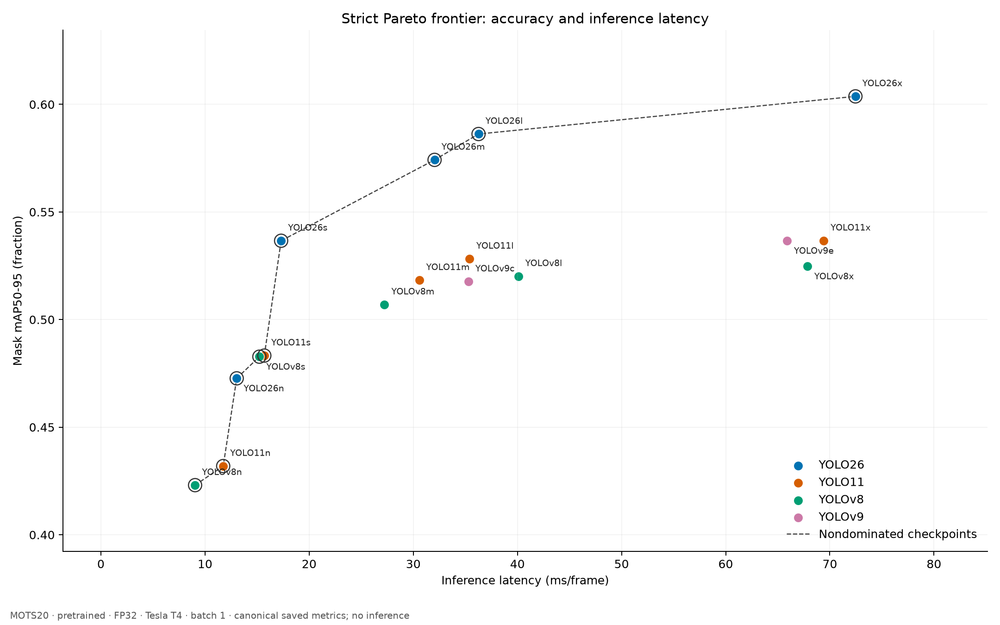

# Complete YOLO Instance Segmentation Scaling Results on MOTS20

## 1. Study Status

**COMPLETE — PASS WITH WARNINGS.** Five completed compatible tiers supply exactly 17 unique official pretrained segmentation checkpoints: YOLO26 = 5, YOLO11 = 5, YOLOv8 = 5, YOLOv9 = 2. Each checkpoint covers the same 2,862 frames and 26,894 frame-level Person GT instances. No training, fine-tuning, inference or tier rerun was performed for synthesis. Source warnings are retained.

The frozen FP32/Tesla T4 protocol and units are in [METHODOLOGY_REFERENCE.md](METHODOLOGY_REFERENCE.md) and [DATA_SCHEMA.md](DATA_SCHEMA.md). [SOURCE_MANIFEST.json](provenance/SOURCE_MANIFEST.json) records repository revisions, canonical CSV hashes, original measurement sources and compatibility checks. Mask AP is pooled across frames, not averaged across sequences.

## 2. Experiment Map

| Tier | Repository | Models | Canonical run |
| --- | --- | --- | --- |
| Largest (X/E) | [Large](https://github.com/folklazy/YOLO_Large_Seg_MOTS20_Benchmark) | 4 | benchmark-20260929T0520Z |
| Second-largest (L/C) | [Second_Largest](https://github.com/folklazy/YOLO_Second_Largest_Seg_MOTS20_Benchmark) | 4 | benchmark-20261001T0352Z |
| Medium (M) | [Medium](https://github.com/folklazy/YOLO_Medium_Seg_MOTS20_Benchmark) | 3 | benchmark-20261002T075505Z |
| Small (S) | [Small](https://github.com/folklazy/YOLO_Small_Seg_MOTS20_Benchmark) | 3 | benchmark-20261005T051531Z |
| Nano (N) | [Nano](https://github.com/folklazy/YOLO_Nano_Seg_MOTS20_Benchmark) | 3 | benchmark-20261005T083307Z |

E/X and C/L are available size categories, not equal-capacity architectures.

## 3. Master 17-Model Results

| Model | Tier | Mask mAP50-95 | AP75 | Recall | Inference ms | Pipeline ms | FPS | VRAM MiB | Parameters | Checkpoint MB |
| --- | --- | --- | --- | --- | --- | --- | --- | --- | --- | --- |
| YOLO26x-Seg | Largest (X/E) | 0.603730 | 0.664426 | 0.846285 | 72.458 | 109.639 | 9.121 | 952.18 | 70,693,800 | 142.13 |
| YOLO11x-Seg | Largest (X/E) | 0.536674 | 0.575845 | 0.822228 | 69.406 | 105.885 | 9.444 | 942.48 | 62,142,656 | 125.09 |
| YOLOv9e-Seg | Largest (X/E) | 0.536642 | 0.572100 | 0.826578 | 65.888 | 103.376 | 9.673 | 855.41 | 60,512,800 | 122.21 |
| YOLOv8x-Seg | Largest (X/E) | 0.524758 | 0.560452 | 0.814271 | 67.843 | 109.441 | 9.137 | 1001.13 | 71,827,888 | 144.10 |
| YOLO26l-Seg | Second-largest (L/C) | 0.586237 | 0.643537 | 0.834387 | 36.266 | 76.403 | 13.089 | 777.52 | 31,515,528 | 63.70 |
| YOLO11l-Seg | Second-largest (L/C) | 0.528228 | 0.565728 | 0.809772 | 35.387 | 76.810 | 13.019 | 794.47 | 27,678,368 | 56.10 |
| YOLOv9c-Seg | Second-largest (L/C) | 0.517646 | 0.559180 | 0.802930 | 35.293 | 76.921 | 13.000 | 838.49 | 27,897,120 | 56.47 |
| YOLOv8l-Seg | Second-largest (L/C) | 0.520145 | 0.558149 | 0.809400 | 40.090 | 83.558 | 11.968 | 855.27 | 45,997,728 | 92.42 |
| YOLO26m-Seg | Medium (M) | 0.574222 | 0.629038 | 0.815312 | 32.043 | 77.309 | 12.935 | 912.16 | 27,112,072 | 54.75 |
| YOLO11m-Seg | Medium (M) | 0.518307 | 0.557205 | 0.805049 | 30.574 | 76.971 | 12.992 | 889.38 | 22,420,896 | 45.40 |
| YOLOv8m-Seg | Medium (M) | 0.506971 | 0.542131 | 0.793857 | 27.232 | 78.112 | 12.802 | 1018.76 | 27,285,968 | 54.92 |
| YOLO26s-Seg | Small (S) | 0.536640 | 0.586796 | 0.789581 | 17.308 | 78.828 | 12.686 | 872.67 | 11,505,800 | 23.47 |
| YOLO11s-Seg | Small (S) | 0.483269 | 0.513823 | 0.764148 | 15.693 | 88.836 | 11.257 | 1007.50 | 10,113,248 | 20.67 |
| YOLOv8s-Seg | Small (S) | 0.482763 | 0.506411 | 0.767309 | 15.220 | 92.173 | 10.849 | 1139.01 | 11,821,056 | 23.91 |
| YOLO26n-Seg | Nano (N) | 0.472698 | 0.506766 | 0.687068 | 13.042 | 82.390 | 12.137 | 1043.13 | 3,126,280 | 6.72 |
| YOLO11n-Seg | Nano (N) | 0.431929 | 0.450826 | 0.693798 | 11.745 | 97.441 | 10.263 | 1030.00 | 2,876,848 | 6.18 |
| YOLOv8n-Seg | Nano (N) | 0.423062 | 0.439115 | 0.696921 | 9.045 | 95.683 | 10.451 | 1117.09 | 3,409,968 | 7.07 |

All AP/Recall values are fractions. Inference/pipeline use ms/frame; FPS = 1000 / mean pipeline ms; VRAM is peak allocated MiB. Parameters are loaded checkpoint counts. The [complete CSV](metrics/MASTER_17_MODELS.csv) also retains AP50, Precision, F1, TP-only IoU/Dice, counts, GFLOPs and protocol/source fields.

## 4. Tier Winners

| Tier | mAP | AP75 | Recall | Inference | Pipeline / FPS | VRAM |
| --- | --- | --- | --- | --- | --- | --- |
| Largest (X/E) | YOLO26x-Seg (0.603730) | YOLO26x-Seg (0.664426) | YOLO26x-Seg (0.846285) | YOLOv9e-Seg (65.888) | YOLOv9e-Seg (103.376) | YOLOv9e-Seg (855.41) |
| Second-largest (L/C) | YOLO26l-Seg (0.586237) | YOLO26l-Seg (0.643537) | YOLO26l-Seg (0.834387) | YOLOv9c-Seg (35.293) | YOLO26l-Seg (76.403) | YOLO26l-Seg (777.52) |
| Medium (M) | YOLO26m-Seg (0.574222) | YOLO26m-Seg (0.629038) | YOLO26m-Seg (0.815312) | YOLOv8m-Seg (27.232) | YOLO11m-Seg (76.971) | YOLO11m-Seg (889.38) |
| Small (S) | YOLO26s-Seg (0.536640) | YOLO26s-Seg (0.586796) | YOLO26s-Seg (0.789581) | YOLOv8s-Seg (15.220) | YOLO26s-Seg (78.828) | YOLO26s-Seg (872.67) |
| Nano (N) | YOLO26n-Seg (0.472698) | YOLO26n-Seg (0.506766) | YOLOv8n-Seg (0.696921) | YOLOv8n-Seg (9.045) | YOLO26n-Seg (82.390) | YOLO11n-Seg (1030.00) |

Pipeline and FPS have the same winner because FPS is derived from pipeline mean. The [winner CSV](metrics/TIER_WINNERS.csv) retains all seven categories and original values.

## 5. Family Scaling

| Family | Models | Largest → smallest available | mAP endpoints | Inference endpoints (ms) |
| --- | --- | --- | --- | --- |
| YOLO26 | 5 | YOLO26x-Seg → YOLO26n-Seg | 0.603730 → 0.472698 | 72.458 → 13.042 |
| YOLO11 | 5 | YOLO11x-Seg → YOLO11n-Seg | 0.536674 → 0.431929 | 69.406 → 11.745 |
| YOLOv8 | 5 | YOLOv8x-Seg → YOLOv8n-Seg | 0.524758 → 0.423062 | 67.843 → 9.045 |
| YOLOv9 | 2 | YOLOv9e-Seg → YOLOv9c-Seg | 0.536642 → 0.517646 | 65.888 → 35.293 |

**Observation:** All 13 adjacent size reductions decrease mAP, forward latency and parameter count. Pipeline latency increases in 8 of the 13 reductions, and allocated VRAM increases in 7. **Interpretation:** checkpoint size predicts neither whole-pipeline speed nor allocator peak by itself.

## 6. Scaling Deltas

Delta = smaller − larger. Negative mAP pp means accuracy loss; negative latency/VRAM percentages mean reductions relative to the larger checkpoint. These columns describe distinct objectives, not a combined score.

| Larger → smaller | ΔmAP pp | ΔInference % | ΔPipeline % | ΔVRAM % | ΔParameters % |
| --- | --- | --- | --- | --- | --- |
| YOLO26x-Seg → YOLO26l-Seg | -1.749 | -49.95 | -30.31 | -18.34 | -55.42 |
| YOLO26l-Seg → YOLO26m-Seg | -1.201 | -11.64 | +1.19 | +17.32 | -13.97 |
| YOLO26m-Seg → YOLO26s-Seg | -3.758 | -45.98 | +1.96 | -4.33 | -57.56 |
| YOLO26s-Seg → YOLO26n-Seg | -6.394 | -24.65 | +4.52 | +19.53 | -72.83 |
| YOLO11x-Seg → YOLO11l-Seg | -0.845 | -49.01 | -27.46 | -15.70 | -55.46 |
| YOLO11l-Seg → YOLO11m-Seg | -0.992 | -13.60 | +0.21 | +11.95 | -18.99 |
| YOLO11m-Seg → YOLO11s-Seg | -3.504 | -48.67 | +15.41 | +13.28 | -54.89 |
| YOLO11s-Seg → YOLO11n-Seg | -5.134 | -25.16 | +9.69 | +2.23 | -71.55 |
| YOLOv8x-Seg → YOLOv8l-Seg | -0.461 | -40.91 | -23.65 | -14.57 | -35.96 |
| YOLOv8l-Seg → YOLOv8m-Seg | -1.317 | -32.07 | -6.52 | +19.12 | -40.68 |
| YOLOv8m-Seg → YOLOv8s-Seg | -2.421 | -44.11 | +18.00 | +11.80 | -56.68 |
| YOLOv8s-Seg → YOLOv8n-Seg | -5.970 | -40.57 | +3.81 | -1.92 | -71.15 |
| YOLOv9e-Seg → YOLOv9c-Seg | -1.900 | -46.43 | -25.59 | -1.98 | -53.90 |

[SCALING_DELTAS.csv](metrics/SCALING_DELTAS.csv) retains absolute and relative changes for mAP, AP50, AP75, Recall, F1, inference, pipeline, FPS, VRAM, parameters and checkpoint MB.

## 7. Pareto Frontier

A checkpoint is nondominated when no other checkpoint has at least its mAP and at most its cost, with one strict improvement. Use unrounded values. No weighted score is calculated.

**Accuracy / inference:** YOLO26x-Seg, YOLO26l-Seg, YOLO26m-Seg, YOLO26s-Seg, YOLO11s-Seg, YOLOv8s-Seg, YOLO26n-Seg, YOLO11n-Seg, YOLOv8n-Seg.

| Model | Tier | Mask mAP50-95 | AP75 | Recall | Inference ms | Pipeline ms | FPS | VRAM MiB |
| --- | --- | --- | --- | --- | --- | --- | --- | --- |
| YOLO26x-Seg | Largest (X/E) | 0.603730 | 0.664426 | 0.846285 | 72.458 | 109.639 | 9.121 | 952.18 |
| YOLO26l-Seg | Second-largest (L/C) | 0.586237 | 0.643537 | 0.834387 | 36.266 | 76.403 | 13.089 | 777.52 |
| YOLO26m-Seg | Medium (M) | 0.574222 | 0.629038 | 0.815312 | 32.043 | 77.309 | 12.935 | 912.16 |
| YOLO26s-Seg | Small (S) | 0.536640 | 0.586796 | 0.789581 | 17.308 | 78.828 | 12.686 | 872.67 |
| YOLO11s-Seg | Small (S) | 0.483269 | 0.513823 | 0.764148 | 15.693 | 88.836 | 11.257 | 1007.50 |
| YOLOv8s-Seg | Small (S) | 0.482763 | 0.506411 | 0.767309 | 15.220 | 92.173 | 10.849 | 1139.01 |
| YOLO26n-Seg | Nano (N) | 0.472698 | 0.506766 | 0.687068 | 13.042 | 82.390 | 12.137 | 1043.13 |
| YOLO11n-Seg | Nano (N) | 0.431929 | 0.450826 | 0.693798 | 11.745 | 97.441 | 10.263 | 1030.00 |
| YOLOv8n-Seg | Nano (N) | 0.423062 | 0.439115 | 0.696921 | 9.045 | 95.683 | 10.451 | 1117.09 |

**Accuracy / allocated VRAM:** YOLO26x-Seg, YOLO26l-Seg.

| Model | Tier | Mask mAP50-95 | AP75 | Recall | Inference ms | Pipeline ms | FPS | VRAM MiB |
| --- | --- | --- | --- | --- | --- | --- | --- | --- |
| YOLO26x-Seg | Largest (X/E) | 0.603730 | 0.664426 | 0.846285 | 72.458 | 109.639 | 9.121 | 952.18 |
| YOLO26l-Seg | Second-largest (L/C) | 0.586237 | 0.643537 | 0.834387 | 36.266 | 76.403 | 13.089 | 777.52 |

These are different objective sets. A model on the inference frontier can be dominated on the VRAM frontier. Dominance does not settle objectives omitted from the frontier, such as Recall, model-file size or a later deployment test.

## 8. Important Research Findings

1. **Observation:** YOLO26 leads mAP and AP75 in every tier. YOLO26x reaches mAP 0.603730. **Interpretation:** these checkpoints are accuracy candidates under this protocol; this does not isolate an architectural cause.
2. **Observation:** YOLO26l has the fastest pipeline (76.403 ms), highest FPS (13.089) and lowest allocated VRAM (777.52 MiB) across all models. **Interpretation:** it is a strong candidate when those system constraints matter, despite being larger than M/S/N checkpoints.
3. **Observation:** YOLO26x → YOLO26l changes mAP by -1.749 pp and inference by -49.95%. **Interpretation:** this measured reduction preserves most accuracy while reducing forward time substantially, if that accuracy loss is acceptable.
4. **Observation:** YOLO26s has mAP 0.536640, almost the same as YOLO11x and YOLOv9e, with inference 17.308 ms. **Interpretation:** cross-generation size labels do not uniquely determine aggregate accuracy. A near tie does not imply identical errors or capacity.
5. **Observation:** s → n is the largest adjacent mAP drop within YOLO26, YOLO11 and YOLOv8: -6.394, -5.134 and -5.970 pp. **Interpretation:** the final size reduction deserves an explicit accuracy budget rather than a default assumption that smaller is better.
6. **Observation:** YOLOv8n has the fastest inference (9.045 ms), but its pipeline is 95.683 ms. **Interpretation:** forward-only ranking does not establish application throughput.

## 9. Near Ties

A descriptive screen uses absolute mAP gap ≤0.001 (0.1 pp). It identifies reporting candidates, not statistical equivalence or practical interchangeability. No significance test was performed.

| Model A | Model B | Absolute mAP gap |
| --- | --- | --- |
| YOLO11x-Seg | YOLOv9e-Seg | 0.000031903 |
| YOLO11x-Seg | YOLO26s-Seg | 0.000033907 |
| YOLOv9e-Seg | YOLO26s-Seg | 0.000002005 |
| YOLOv9c-Seg | YOLO11m-Seg | 0.000660396 |
| YOLO11s-Seg | YOLOv8s-Seg | 0.000505355 |

Same-tier visual checks remain in each tier’s PRESENTATION_SUMMARY_TH.md. The cross-tier near-tie pairs above were not newly inspected visually in this synthesis; aggregate score proximity alone does not establish identical prediction behavior.

## 10. Anomalies

- YOLO26l → YOLO26m reduces inference by -11.64%, while pipeline changes by +1.19% and allocated VRAM by +17.32%. These are measured directions, not proof that small timing gaps are reproducible superiority.
- In Nano, YOLO26n leads AP75 but has Recall 0.687068, below YOLO11n (0.693798) and YOLOv8n (0.696921). Aggregate mask accuracy and fixed-threshold coverage differ.
- Postprocessing means increase from 39.887 ms for YOLOv8x to 84.911 ms for YOLOv8n. This stage trend is consistent with the nonmonotonic pipeline results; the synthesis does not establish why output workloads differ.
- Separately measured RLE preparation is excluded from every pipeline/FPS value. Adding it would change the throughput definition; the existing FPS values must not be presented as mask-saving throughput.

## 11. Limitations

This is frame-level Person instance segmentation, not MOTS tracking. GT counts are annotations across frames, not unique people. Consecutive frames are correlated. No statistical significance, equivalence or robustness test was conducted. TP-only IoU/Dice exclude unmatched instances and can compare different matched subsets. E/X and C/L are not equal capacities; pretraining and checkpoint construction also confound architectural causality.

Timing comes from accepted clean repetitions under one frozen environment but different sessions; contamination controls do not remove all session variation. Pipeline excludes image decode, loading, RLE preparation and output writing. VRAM is an allocator peak, not total GPU memory or an OOM limit. Family curves connect observed checkpoints and are not a fitted scaling law.

MOTS20 does not establish CCTV robustness to blur, lighting, camera angle or occlusion severity, nor deployment readiness. Existing tier qualitative cases are diagnostic selections, not representative samples. The two Pareto fronts cover only their named objectives.

## 12. Candidate Models for CCTV Robustness Evaluation

| Priority | Candidate | Evidence and condition |
| --- | --- | --- |
| Accuracy | YOLO26x-Seg | mAP 0.603730; inference 72.458 ms |
| Pipeline / Low VRAM / balanced constraints | YOLO26l-Seg | pipeline 76.403 ms; VRAM 777.52 MiB; mAP 0.586237 |
| Shorter forward latency with retained accuracy | YOLO26s-Seg | inference 17.308 ms; mAP 0.536640; latency-frontier candidate |
| Nano mask accuracy | YOLO26n-Seg | mAP 0.472698; Recall 0.687068 is lowest within Nano |
| Minimum inference latency | YOLOv8n-Seg | inference 9.045 ms; mAP 0.423062; not the pipeline winner |

These are conditional candidates for later CCTV robustness evaluation. A single universal winner is not selected. The next step requires a separately authorized robustness dataset/protocol and deployment timing that includes the required I/O and output stages. This synthesis starts no additional experiment.

Further reading: [Thai research insights](RESEARCH_INSIGHTS_TH.md), [executive summary](EXECUTIVE_SUMMARY_TH.md), [meeting summary](MEETING_SUMMARY_TH.md), [metric guide](METRIC_GUIDE_TH.md).
