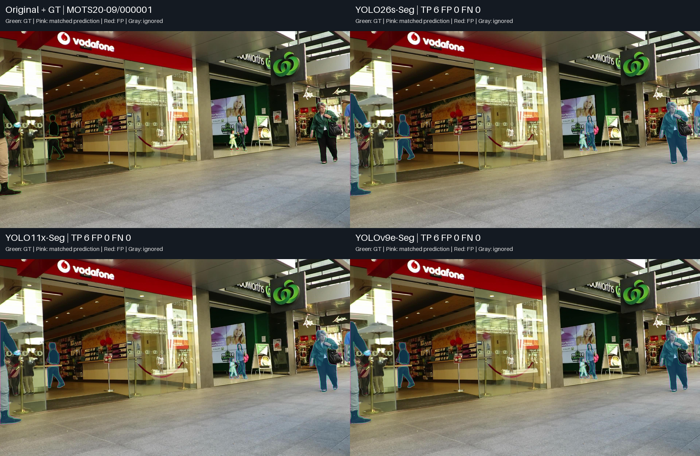
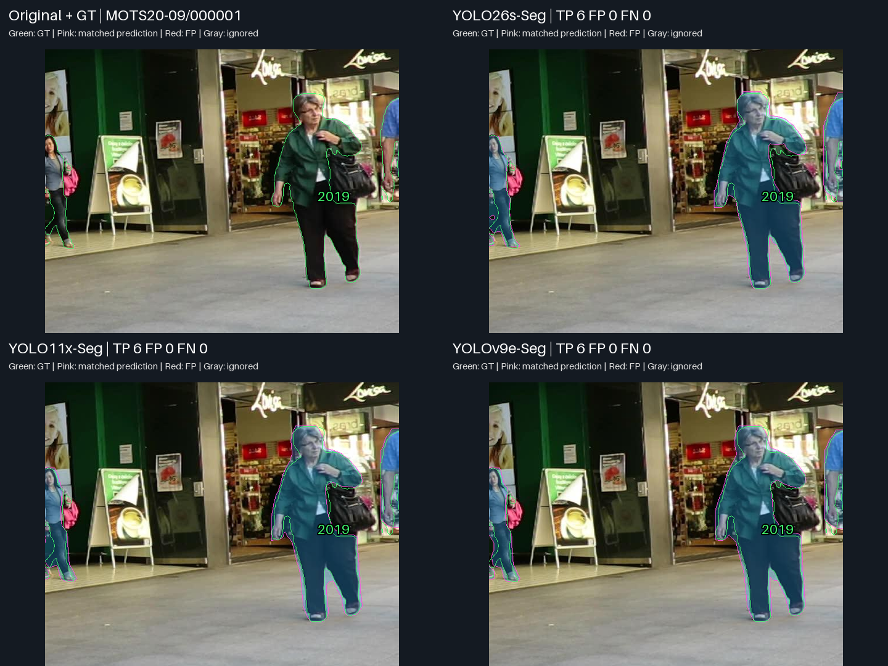
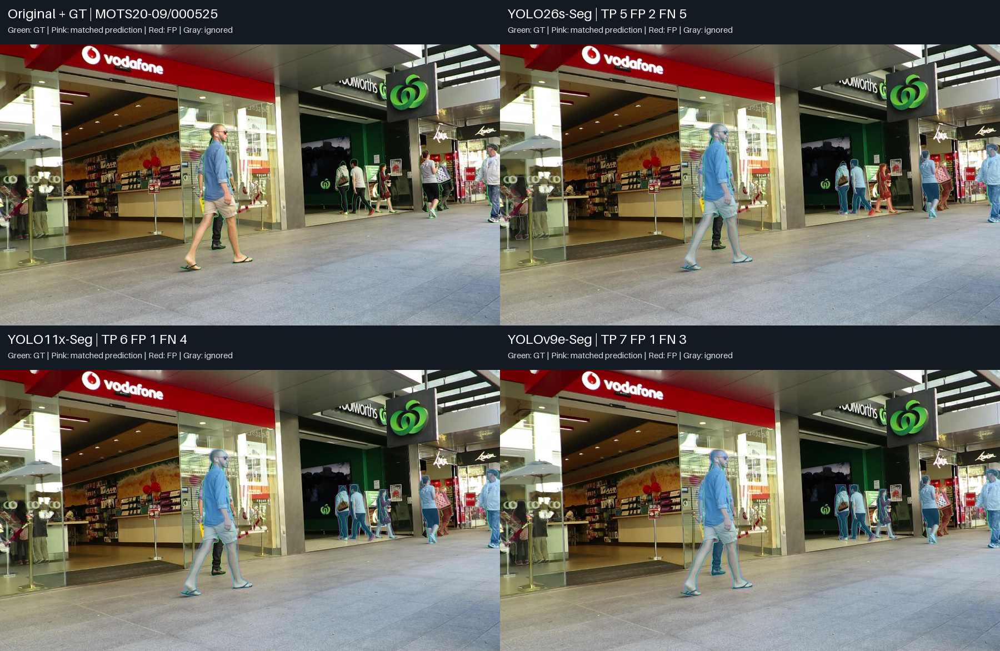
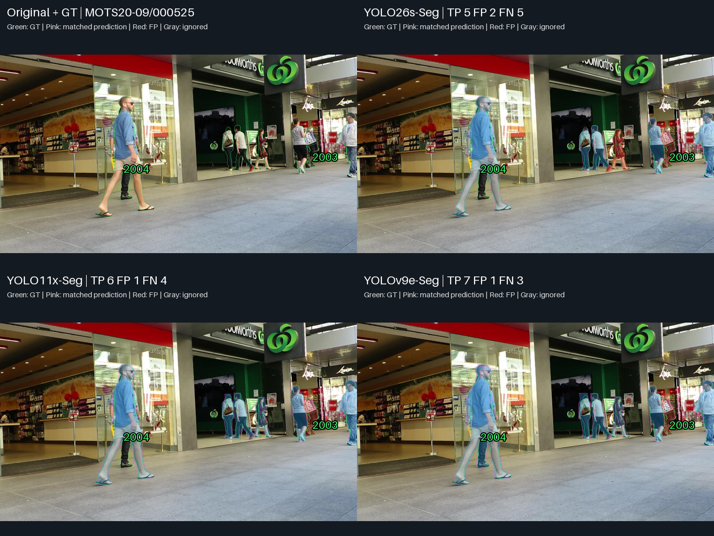
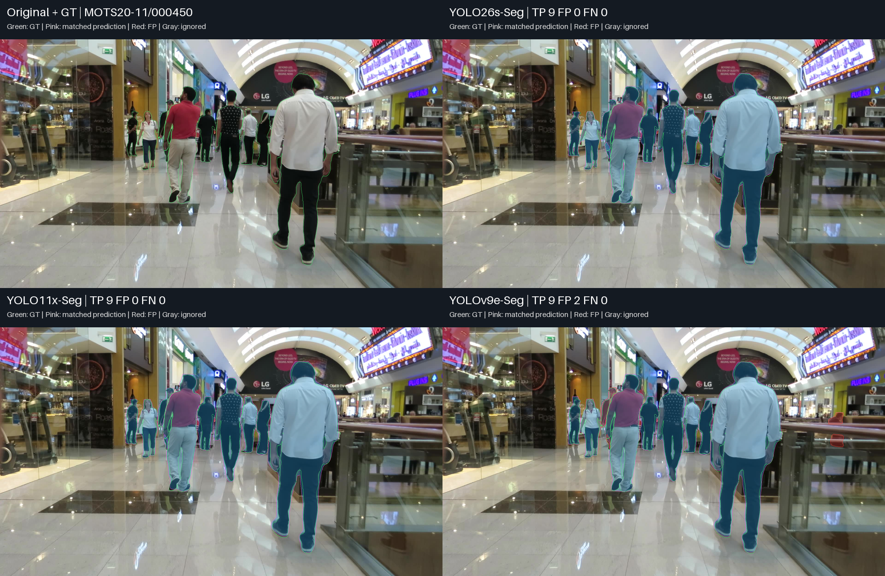
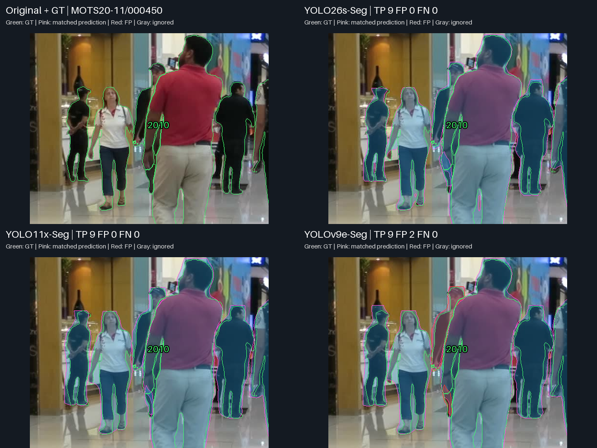
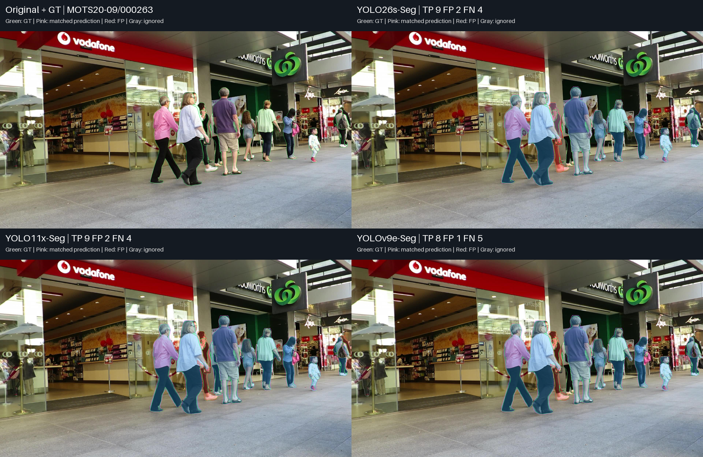
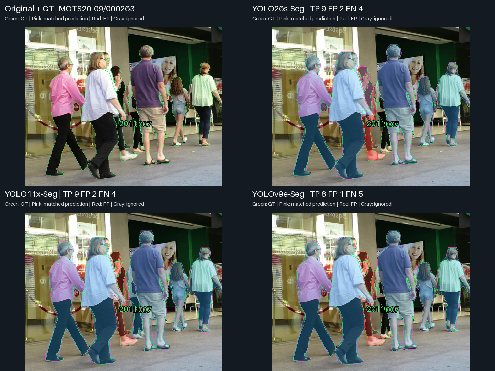

# YOLO26s / YOLO11x / YOLOv9e — Near-Tie Visual Analysis

**สถานะ: diagnostic qualitative analysis จาก saved predictions เท่านั้น; ไม่มี inference หรือ benchmark ใหม่**

## ภาพรวมและวิธีอ่านหลักฐาน

ใช้ original MOTS20/GT และ saved lossless RLE จาก benchmark ที่เสร็จแล้ว ทุก panel ใน case ใช้เฟรมเดียวกัน confidence ≥0.25, one-to-one mask matching IoU ≥0.50 และ ignore IoA ≥0.50 ตาม policy เดิม สีเขียวเป็น GT, สีชมพูเป็น matched prediction, สีแดงเป็น FP และสีเทาเป็น ignored prediction ซึ่งไม่ถูกนับ FP

Panel เรียงซ้ายไปขวา: Original/GT, YOLO26s ในแถวแรก; YOLO11x, YOLOv9e ในแถวที่สอง

Full-frame อยู่ทุก case และ ROI เป็นภาพเสริมที่ใช้พิกัด/scale เดียวกันทุกโมเดล การขยายไม่เพิ่มรายละเอียดต้นฉบับ TP/FP/FN ด้านล่างเป็น counts ของเต็มเฟรม ไม่ใช่เฉพาะ ROI FN อาจมี prediction อยู่แล้วแต่ไม่ผ่าน confidence/matching; FP เป็น unmatched prediction ไม่จำเป็นต้องเป็นคนที่ไม่มีจริง

เลือกจาก existing diagnostic pool และ per-frame CSV ให้มี control, ความต่าง, counterexample และ common failure ไม่ใช่ representative sample หรือ full-dataset extrema เฟรมที่ซ้ำกับรายงาน tier/รายงานอื่นไม่เพิ่มจำนวน independent samples

[Case selection](outputs/visualizations/near_tie_26s_11x_v9e/v1/CASE_SELECTION.md) · [Evidence, source hashes and ROI](outputs/visualizations/near_tie_26s_11x_v9e/v1/EVIDENCE.json)

## Case 1 — ผลหลักคล้ายกันใน control

**เฟรม:** MOTS20-09 / 000001

**เหตุผลที่เลือก:** same coverage control

### ภาพเปรียบเทียบ

### ภาพขยาย

ROI xyxy: `[1306, 314, 1920, 806]`; ภาพเต็มด้านบนยังคงแสดง error นอก ROI

### สิ่งที่เห็นจากภาพ

- ทั้งสาม match valid GT ครบ 6 instances ไม่มี FP/FN
- GT 2019 คนเสื้อเขียวด้านขวาถูก match ทุกโมเดลและมีรูปทรง mask ใกล้กัน; IoU ของ 26s/11x/v9e เป็น 0.877/0.865/0.863

| Model | TP | FP | FN |
|---|---:|---:|---:|
| YOLO26s-Seg | 6 | 0 | 0 |
| YOLO11x-Seg | 6 | 0 | 0 |
| YOLOv9e-Seg | 6 | 0 | 0 |

GT-level diagnostics จาก saved masks; TP เป็น matched IoU ส่วน FN เป็น best candidate IoU ที่ confidence เดิม:

| GT | YOLO26s-Seg | YOLO11x-Seg | YOLOv9e-Seg |
|---|---|---|---|
| 2019 | TP IoU 0.877 | TP IoU 0.865 | TP IoU 0.863 |

### วิเคราะห์

มีภาพที่ near-tied checkpoints ให้ coverage เหมือนกันและ mask ของคนหลักคล้ายกัน แต่ IoU ของ 26s สูงกว่าสองรุ่นใหญ่สำหรับ GT นี้ ไม่ใช้ control นี้พิสูจน์ว่า output เหมือนกันทั้งหมด

### เชื่อมกับผลเชิงตัวเลข

Aggregate mAP ใกล้กันอาจอยู่ร่วมกับผลคล้ายกันบางเฟรมได้ แต่ไม่ใช่ equivalence หรือการทดสอบนัยสำคัญ

### ขอบเขตของหลักฐาน

ผลเฉพาะเฟรมนี้ไม่แทน dataset-level metrics หรือความถี่ของ failure Candidate IoU ต่ำกว่า threshold เป็น diagnostic overlap ไม่รับประกันว่าจะกลายเป็น TP หากเปลี่ยน confidence และยังต้องใช้ one-to-one/ignore policy เดิม

## Case 2 — รุ่นใหญ่เก็บ GT เพิ่ม และมี failure ร่วมบนคนจริง

**เฟรม:** MOTS20-09 / 000525

**เหตุผลที่เลือก:** different GT coverage despite near-equal pooled mAP

### ภาพเปรียบเทียบ

### ภาพขยาย

ROI xyxy: `[247, 110, 1920, 1039]`; ภาพเต็มด้านบนยังคงแสดง error นอก ROI

### สิ่งที่เห็นจากภาพ

- 26s/11x/v9e มี TP 5/6/7, FP 2/1/1 และ FN 5/4/3
- GT 2004 หลังคนเสื้อฟ้าทางซ้าย match เฉพาะ v9e; 11x มี saved candidate IoU ประมาณ 0.564 แต่ confidence 0.217 ต่ำกว่า 0.25 ส่วน v9e ผ่านด้วย confidence ประมาณ 0.254
- GT 2003 ทางขวาไม่ match ทั้งสาม แต่มี red unmatched mask ในบริเวณนั้น; best IoU ที่ confidence เดิมเป็น 0.350/0.342/0.437

| Model | TP | FP | FN |
|---|---:|---:|---:|
| YOLO26s-Seg | 5 | 2 | 5 |
| YOLO11x-Seg | 6 | 1 | 4 |
| YOLOv9e-Seg | 7 | 1 | 3 |

GT-level diagnostics จาก saved masks; TP เป็น matched IoU ส่วน FN เป็น best candidate IoU ที่ confidence เดิม:

| GT | YOLO26s-Seg | YOLO11x-Seg | YOLOv9e-Seg |
|---|---|---|---|
| 2003 | FN; best IoU 0.350 | FN; best IoU 0.342 | FN; best IoU 0.437 |
| 2004 | FN; best IoU 0.069 | FN; best IoU 0.029 | TP IoU 0.610 |

### วิเคราะห์

v9e มี coverage มากกว่าในเฟรมนี้ แต่ GT 2003 เป็น failure ร่วม แม้สร้าง mask ได้ การพลาด GT 2004 ของ 11x เกี่ยวข้องกับ operating point ด้วย ไม่ใช่หลักฐานว่าไม่มี candidate mask เลย และไม่รับประกันว่าลด threshold แล้วจะเป็น TP โดยไม่มี FP เพิ่ม

### เชื่อมกับผลเชิงตัวเลข

สอดคล้องในทิศทางกับ Recall รวมของ 26s ที่ต่ำกว่าสองรุ่นใหญ่ แต่ภาพเดียวไม่อธิบายความต่างทั้งหมด และ mAP ใช้ confidence ranking ต่างจาก fixed-confidence counts ในภาพ

### ขอบเขตของหลักฐาน

ผลเฉพาะเฟรมนี้ไม่แทน dataset-level metrics หรือความถี่ของ failure Candidate IoU ต่ำกว่า threshold เป็น diagnostic overlap ไม่รับประกันว่าจะกลายเป็น TP หากเปลี่ยน confidence และยังต้องใช้ one-to-one/ignore policy เดิม

## Case 3 — Coverage เท่ากัน แต่ extra masks ต่างกันชัด

**เฟรม:** MOTS20-11 / 000450

**เหตุผลที่เลือก:** same coverage and differing extra masks

### ภาพเปรียบเทียบ

### ภาพขยาย

ROI xyxy: `[474, 201, 967, 595]`; ภาพเต็มด้านบนยังคงแสดง error นอก ROI

### สิ่งที่เห็นจากภาพ

- ทั้งสาม match valid GT ครบ 9 instances ไม่มี FN; 26s/11x ไม่มี FP ส่วน v9e มี FP สอง masks
- ROI ของ GT 2010 แสดง red mask เพิ่มใน v9e บนคนที่มี matched prediction อยู่แล้ว FP นี้มี IoU ประมาณ 0.648 กับ GT แต่ one-to-one matching ไม่ให้เป็น TP เพิ่ม
- ภาพเต็มแสดง FP อีก mask ของ v9e ที่ราวด้านขวา ซึ่งไม่ทับ valid GT; ROI ไม่ได้แสดงข้อผิดพลาดนอกบริเวณทั้งหมด

| Model | TP | FP | FN |
|---|---:|---:|---:|
| YOLO26s-Seg | 9 | 0 | 0 |
| YOLO11x-Seg | 9 | 0 | 0 |
| YOLOv9e-Seg | 9 | 2 | 0 |

GT-level diagnostics จาก saved masks; TP เป็น matched IoU ส่วน FN เป็น best candidate IoU ที่ confidence เดิม:

| GT | YOLO26s-Seg | YOLO11x-Seg | YOLOv9e-Seg |
|---|---|---|---|
| 2010 | TP IoU 0.614 | TP IoU 0.638 | TP IoU 0.576 |

### วิเคราะห์

Near-tied aggregate score ซ่อนภาระ extra-output ได้ GT 2010 ของ v9e มี matched IoU ประมาณ 0.576 ซึ่งต่ำกว่า IoU ของ extra mask เพราะ evaluator จับตาม confidence ก่อน ต้องรักษา policy เดิม ไม่สลับคู่ย้อนหลังเพื่อทำให้ผลดูดี FP บนราวไม่ยืนยันว่าไม่มีคนจริงจากภาพเดียว

### เชื่อมกับผลเชิงตัวเลข

เป็นตัวอย่างที่ 26s/11x มี output ส่วนเกินน้อยกว่า v9e ขณะที่ Case 2 ให้ v9e มี coverage มากกว่า จึงไม่ถือว่าใครชนะทุกกรณี หรือสรุป frequency จาก case selection

### ขอบเขตของหลักฐาน

ผลเฉพาะเฟรมนี้ไม่แทน dataset-level metrics หรือความถี่ของ failure Candidate IoU ต่ำกว่า threshold เป็น diagnostic overlap ไม่รับประกันว่าจะกลายเป็น TP หากเปลี่ยน confidence และยังต้องใช้ one-to-one/ignore policy เดิม

## Case 4 — TP เท่ากัน แต่ GT คนละชุด และ v9e มี FP น้อยกว่า

**เฟรม:** MOTS20-09 / 000263

**เหตุผลที่เลือก:** counterexample and common failure

### ภาพเปรียบเทียบ

### ภาพขยาย

ROI xyxy: `[736, 236, 1530, 871]`; ภาพเต็มด้านบนยังคงแสดง error นอก ROI

### สิ่งที่เห็นจากภาพ

- 26s/11x มี TP 9, FP 2, FN 4 เท่ากัน แต่ 26s เก็บ GT 2001 ที่ 11x พลาด และ 11x เก็บ GT 2007 ที่ 26s พลาด
- v9e มี TP 8, FP 1, FN 5; GT 2007 ไม่ match แต่มี saved candidate IoU ประมาณ 0.707 ที่ confidence 0.243 ต่ำกว่า 0.25
- GT 2011 ไม่ match ทั้งสาม และมี unmatched prediction บนบริเวณคนจริง โดย best IoU ยังต่ำกว่า 0.50

| Model | TP | FP | FN |
|---|---:|---:|---:|
| YOLO26s-Seg | 9 | 2 | 4 |
| YOLO11x-Seg | 9 | 2 | 4 |
| YOLOv9e-Seg | 8 | 1 | 5 |

GT-level diagnostics จาก saved masks; TP เป็น matched IoU ส่วน FN เป็น best candidate IoU ที่ confidence เดิม:

| GT | YOLO26s-Seg | YOLO11x-Seg | YOLOv9e-Seg |
|---|---|---|---|
| 2007 | FN; best IoU 0.054 | TP IoU 0.638 | FN; best IoU 0.034 |
| 2011 | FN; best IoU 0.404 | FN; best IoU 0.379 | FN; best IoU 0.412 |

### วิเคราะห์

เป็น counterexample ต่อ Case 2: v9e มี matched coverage น้อยกว่า แต่ FP น้อยกว่า อีกสองโมเดลมี counts เท่ากันโดยไม่ได้เก็บคนชุดเดียวกัน ส่วนของ 26s บน GT 2007 มี candidate ที่ confidence ต่ำมากใน saved predictions จึงไม่ควรตีความ FN ว่าไม่มี mask เลย

### เชื่อมกับผลเชิงตัวเลข

Near-equal mAP ไม่ระบุว่า error เกิดที่คนใด ผลนี้จึงใช้สนับสนุนการดู GT-level diagnostics ร่วมกับ Recall/Precision รวม โดยไม่พิสูจน์ statistical equivalence

### ขอบเขตของหลักฐาน

ผลเฉพาะเฟรมนี้ไม่แทน dataset-level metrics หรือความถี่ของ failure Candidate IoU ต่ำกว่า threshold เป็น diagnostic overlap ไม่รับประกันว่าจะกลายเป็น TP หากเปลี่ยน confidence และยังต้องใช้ one-to-one/ignore policy เดิม

## Failure Analysis

| Failure pattern | Models observed | Case | Interpretation |
|---|---|---|---|
| GT coverage ต่างกัน | 26s/11x/v9e | 2/4 | near-equal mAP ไม่ใช่ GT ชุดเดียวกัน |
| Extra masks บน GT ที่มีคู่แล้ว/ไม่ทับ valid GT | v9e | 3 | one-to-one matching; ไม่ยืนยัน nonexistent person |
| Common unmatched GT มี prediction ในบริเวณนั้น | ทุกโมเดล | 2/4 | mask presence ไม่รับประกัน IoU ผ่าน |

## สิ่งที่เรียนรู้จากภาพจริง

**Observation:** มี control ที่ coverage เท่ากัน แต่กรณีอื่นมีทั้ง GT ชุดต่างกันและ extra outputs ต่างกัน

**Interpretation:** การเลือกต้องดูชนิดและตำแหน่งของ error ร่วมกับ pooled metrics ไม่สรุปจาก counts หรือภาพคนใหญ่เพียงอย่างเดียว

**Observation:** ตัวอย่างมีทั้งผลที่สอดคล้องและสวนอันดับรวม รวมถึง common failures

**Interpretation:** ขนาด/คะแนนรวมไม่รับรองคุณภาพต่อ GT ทุกคน และกรณีที่เลือกไม่วัดความถี่หรือ causal architecture effect

## เมื่อดูทั้งตัวเลขและภาพร่วมกัน

YOLO26s/YOLO11x/YOLOv9e ผ่าน descriptive near-tie screen |ΔmAP| ≤0.001 แต่ Recall ของ 26s ต่ำกว่า และภาพมี error trade-offs ต่างกัน Case 2 ให้ v9e มี coverage มากกว่า ส่วน Case 3 ให้ 26s/11x มี FP น้อยกว่า ไม่เรียกว่า equivalence

Latency และ VRAM เป็น system measurements จาก benchmark ภาพ segmentation ไม่วัดสองค่านี้ Pipeline FPS ไม่รวม decode, RLE preparation และการเขียนผล

## ใช้ประกอบการเลือกอย่างไร

หากเน้นความครบถ้วน ให้ตรวจ GT coverage และ Recall รวม หากเน้น mask extraction ให้ตรวจ foreground loss/พื้นที่ติดเกินและ diagnostics ของคนเดียวกัน ส่วนข้อจำกัด speed/memory อ่านจาก CSV ภาพเหล่านี้ไม่ประกาศผู้ชนะทุกด้านหรือ final CCTV superiority

## ข้อจำกัด

- เฟรมที่เลือกเป็น diagnostic examples ไม่ใช่ random representative sample และเฟรมวิดีโอสัมพันธ์กัน
- Overlay และภาพย่ออาจซ่อนรายละเอียดพิกเซล; ค่าราย GT ช่วยตรวจ overlap ไม่ใช่ boundary metric โดยตรง
- ไม่มี statistical significance/equivalence test หรือการวัด tracking
- ไม่อนุมาน blur/low-light/มุมกล้อง/occlusion robustness หรือ deployment readiness
- Capacity/checkpoints/pretraining ต่างกันใน cross-generation comparison; ไม่พิสูจน์ architecture causality

## รายละเอียดเพิ่มเติม

[Canonical results](metrics/MASTER_17_MODELS.csv) · [Research insights](RESEARCH_INSIGHTS_TH.md) · [Technical record](MASTER_RESULTS.md) · [x/l visual study](YOLO26X_VS_YOLO26L_VISUAL_TH.md)
