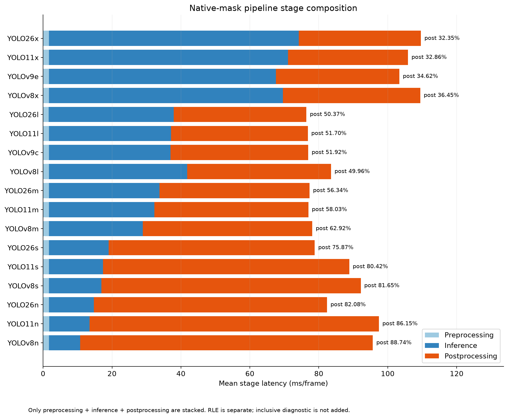
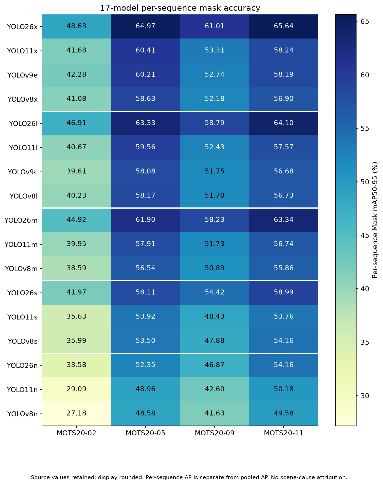

# Research Insights — YOLO Instance Segmentation Scaling on MOTS20

## สรุปใน 1 นาที

- YOLO26 นำ pooled mAP/AP75 ทั้งห้า tiers และนำ sequence mAP ครบ 20 tier × sequence comparisons; เป็นผลของ checkpoints ที่วัด ไม่ใช่ข้อพิสูจน์สาเหตุจาก architecture
- YOLO26x → l ลด mAP -1.749 percentage points แลก inference -49.95% และ pipeline -30.31%
- Accuracy–pipeline Pareto เหลือ x/l; objective นี้ให้ข้อสรุปต่างจาก accuracy–inference ที่มีเก้า candidates
- Postprocessing มากกว่าครึ่ง pipeline ใน 12 จาก 17 โมเดล; forward ที่เร็วขึ้นไม่รับประกัน throughput ที่สูงขึ้น
- YOLO26s/YOLO11x/YOLOv9e มี aggregate mAP ใกล้กันมาก แต่ resource และ Recall ต่างกัน
- Ranking ของรุ่นรองเปลี่ยนบาง sequence; ทุกตระกูลมี endpoint accuracy drop มากสุดใน MOTS20-02 แต่ยังไม่ระบุสาเหตุจากฉาก
- s → n เป็น adjacent mAP drop ที่มากสุดในทั้ง YOLO26/YOLO11/YOLOv8 ขณะที่ pipeline และ memory ไม่ได้ดีขึ้นเสมอ

## 1. YOLO26 นำ accuracy อย่างสม่ำเสมอแค่ไหน

**Observation:** YOLO26 นำ mAP/AP75 รวมทั้งห้า tiers และมี mAP สูงสุดในทุก tier × sequence รวม 20 comparisons YOLO26x มี pooled mAP 0.603730 แต่ Recall winner ใน Nano เป็น YOLOv8n ไม่ใช่ YOLO26n

**Interpretation:** หลักฐานสอดคล้องกันทั้ง pooled และ per-sequence accuracy ภายใต้ protocol นี้ แต่การแบ่ง tier ไม่ทำให้ parameters หรือ pretraining เท่ากัน จึงไม่แยกผลของ architecture ออกจาก capacity/checkpoint/training เดิม และไม่รับรองว่าตัวนำจะเก็บ GT เพิ่มทุกเฟรม

## 2. จุดลดต้นทุนที่เด่น: YOLO26x → YOLO26l

| ด้าน | การเปลี่ยน l − x |
|---|---:|
| Mask mAP50-95 | -1.749 percentage points |
| Recall | -1.190 percentage points |
| Inference | -49.95% |
| Pipeline | -30.31% |
| Peak allocated VRAM | -18.34% |
| Parameters | -55.42% |

**Observation:** l มี mAP อันดับสอง และ pipeline/allocated VRAM ต่ำสุดทั้งชุด Accuracy–pipeline และ accuracy–VRAM Pareto ต่างเหลือเพียง YOLO26x/YOLO26l

**Interpretation:** x → l เป็น candidate efficiency point หรือ descriptive knee ภายใต้ objectives ที่วัด ไม่ใช่ universal sweet spot เพราะบางงานให้ความสำคัญกับ forward latency หรือ checkpoint size มากกว่า

อ่าน [รายงานภาพ x/l แบบละเอียด](YOLO26X_VS_YOLO26L_VISUAL_TH.md): same-frame saved predictions แสดงทั้ง coverage advantage, mask overlap ต่างกัน, l counterexample และ common failure โดยไม่อ้างว่า x ดีกว่าทุกคนในทุกเฟรม

## 3. ทำไม model เล็กลงแต่ pipeline ไม่เร็วขึ้นเสมอ

**Observation:** YOLO26x มี inference share 66.09% และ postprocess share 32.35% ส่วน YOLO26n มี postprocess share 82.08% และ YOLOv8n 88.74% ของ pipeline Preprocess + inference + postprocess ตรงกับ pipeline ภายใน tolerance 1e-10 ms จากความละเอียดตัวเลขต้นทาง

**Interpretation:** ใน native-mask pipeline นี้ งานหลัง forward เป็นข้อจำกัดสำคัญเมื่อ checkpoint เล็กลง Stage trends สอดคล้องกับข้อจำกัดดังกล่าว แต่ยังไม่พิสูจน์ว่าขนาดโมเดลหรือ architecture ทำให้ postprocessing ช้าลงโดยตรง และไม่รับรองพฤติกรรมเดียวกันใน deployment pipeline อื่น

RLE preparation ถูกวัดแยก ไม่รวมใน pipeline FPS ส่วน ultralytics_postprocess_inclusive เป็น diagnostic subset ไม่บวกซ้ำ ดู [TIMING_COMPOSITION.csv](metrics/TIMING_COMPOSITION.csv)

## 4. Accuracy ใกล้กันมาก แต่ computational cost ต่างกันมาก

| Model | Mask mAP50-95 | Recall | Inference ms | Pipeline ms | VRAM MiB | Checkpoint MB |
|---|---:|---:|---:|---:|---:|---:|
| YOLO26s-Seg | 0.536640 | 0.789581 | 17.308 | 78.828 | 872.67 | 23.47 |
| YOLO11x-Seg | 0.536674 | 0.822228 | 69.406 | 105.885 | 942.48 | 125.09 |
| YOLOv9e-Seg | 0.536642 | 0.826578 | 65.888 | 103.376 | 855.41 | 122.21 |

**Observation:** YOLO26s − YOLO11x มี absolute mAP gap เพียง 0.003391 percentage points แต่ inference -75.06%, pipeline -25.55% และ parameters -81.48% ส่วน YOLO26s − YOLOv9e ใช้ allocated VRAM เพิ่ม +2.02%

**Interpretation:** Aggregate mAP is descriptively near-equal under this benchmark แต่ resource requirements ต่างกันมาก และ YOLO26s มี Recall ต่ำกว่าสองรุ่นใหญ่ จึงไม่ใช่ equivalence หรือหลักฐาน architecture superiority

คู่ YOLOv9c/YOLO11m มี mAP ใกล้กันและ pipeline delta เพียง +0.051 ms ส่วน YOLO11s/YOLOv8s มี near-tied mAP แต่ YOLOv8s forward เร็วกว่า ขณะที่ pipeline และ VRAM สูงกว่า ดูทุกคู่และทิศทาง B − A ใน [NEAR_TIE_RESOURCE_DELTAS.csv](metrics/NEAR_TIE_RESOURCE_DELTAS.csv)

## 5. Sequence sensitivity และความสม่ำเสมอของ ranking

**Observation:** YOLO26 นำ mAP ทุก tier × sequence แต่ ranking ของรุ่นรองเปลี่ยน: YOLOv9e สูงกว่า YOLO11x ใน 02, YOLOv9c สูงกว่า YOLOv8l ใน 09 และ YOLOv8s สูงกว่า YOLO11s ใน 02/11 เทียบกับ pooled ordering MOTS20-02 มี measured mAP ต่ำสุดของแต่ละโมเดลครบทั้ง 17 ตัว

เมื่อดู endpoint x → n, YOLO26 เสีย mAP ใน 02 ประมาณ 15.057 pp เทียบกับ 11 ประมาณ 11.480 pp; YOLO11/YOLOv8 ก็เสียมากสุดใน 02 และน้อยสุดใน 11 ส่วน YOLOv9 e → c เสียมากสุดใน 02 และน้อยสุดใน 09

**Interpretation:** Sequence sensitivity ไม่เหมือนกัน และ aggregate ranking ไม่แทน ranking ทุก sequence ยังไม่มีหลักฐานให้ระบุว่าเกิดจาก blur, low light, camera angle หรือ occlusion severity AP รวมเป็น pooled AP ไม่ใช่ค่าเฉลี่ย AP ของสี่ sequences ดู [PER_SEQUENCE_SCALING_ANALYSIS.csv](metrics/PER_SEQUENCE_SCALING_ANALYSIS.csv)

## 6. Scaling cliff เมื่อ s → n

| Family | Δ mAP (pp) | Δ inference (%) | Δ pipeline (%) | Δ VRAM (%) |
|---|---:|---:|---:|---:|
| YOLO26 | -6.394 | -24.65 | +4.52 | +19.53 |
| YOLO11 | -5.134 | -25.16 | +9.69 | +2.23 |
| YOLOv8 | -5.970 | -40.57 | +3.81 | -1.92 |

**Observation:** s → n เป็น adjacent mAP drop มากสุดของทั้งสามตระกูล Forward ลดลง แต่ pipeline เพิ่มทั้งสาม ส่วน VRAM เพิ่มใน YOLO26/YOLO11 และลดใน YOLOv8

**Interpretation:** Nano เป็น candidate เมื่อ forward/ขนาด checkpoint เป็นข้อจำกัดเฉพาะ ไม่เลือกจากชื่อขนาดเพียงอย่างเดียว และไม่เรียกการลดขนาดนี้ว่าคุ้มทุก objective

## 7. สิ่งที่ภาพจริงบอก แต่ aggregate metric ไม่บอก

**Observation:** รายงาน tier พบทั้ง TP เท่ากันแต่ match GT คนละชุด, extra masks บน GT ที่มีคู่แล้ว, common FN และกรณีที่ accuracy leader ไม่ได้ match มากสุด รายงาน x/l ยังแยก candidate confidence ต่ำกว่า threshold ออกจาก mask overlap ที่ไม่ผ่านเกณฑ์

**Interpretation:** FP คือ unmatched prediction ตาม policy ไม่ใช่คนที่ไม่มีจริงโดยอัตโนมัติ FN คือ unmatched GT และอาจมี mask อยู่แล้ว Selected frames เป็น diagnostic ไม่ใช่ representative sample หรือหลักฐาน statistical equivalence

- [Largest (X/E) qualitative research](https://github.com/folklazy/YOLO_Large_Seg_MOTS20_Benchmark/blob/main/PRESENTATION_SUMMARY_TH.md)
- [Second-largest (L/C) qualitative research](https://github.com/folklazy/YOLO_Second_Largest_Seg_MOTS20_Benchmark/blob/main/PRESENTATION_SUMMARY_TH.md)
- [Medium qualitative research](https://github.com/folklazy/YOLO_Medium_Seg_MOTS20_Benchmark/blob/main/PRESENTATION_SUMMARY_TH.md)
- [Small qualitative research](https://github.com/folklazy/YOLO_Small_Seg_MOTS20_Benchmark/blob/main/PRESENTATION_SUMMARY_TH.md)
- [Nano qualitative research](https://github.com/folklazy/YOLO_Nano_Seg_MOTS20_Benchmark/blob/main/PRESENTATION_SUMMARY_TH.md)

- [YOLO26x → l detailed visual comparison](YOLO26X_VS_YOLO26L_VISUAL_TH.md)
- [YOLO26 scaling ladder](YOLO26_SCALING_VISUAL_TH.md)
- [26s / 11x / v9e near-tie visual comparison](NEAR_TIE_26S_11X_V9E_VISUAL_TH.md)

## 8. Accuracy vs Inference vs Pipeline vs Memory

**Observation:** Accuracy–inference Pareto มีเก้าโมเดล ส่วน accuracy–pipeline และ accuracy–allocated VRAM มีสองโมเดลคือ YOLO26x/YOLO26l

**Interpretation:** การเลือก objective เปลี่ยน candidate set งาน forward-budget อาจเลือก Small/Nano ได้ ขณะที่ native-mask pipeline-budget ให้น้ำหนัก l มากขึ้น ภาพ segmentation วัด latency/VRAM ไม่ได้ และไม่มี weighted overall score

[Inference Pareto](metrics/PARETO_FRONTIER.csv) · [Pipeline Pareto](metrics/PARETO_PIPELINE.csv) · [VRAM Pareto](metrics/PARETO_VRAM.csv)

## 9. Candidate ตามข้อจำกัด

| Priority | Candidate | หลักฐานและข้อแลกเปลี่ยน |
|---|---|---|
| Accuracy | YOLO26x-Seg | นำ pooled mAP/AP75/Recall แต่มี counterexamples ในภาพจริง |
| Whole-pipeline efficiency | YOLO26l-Seg | Pipeline mean ต่ำสุดและ mAP อันดับสอง; อยู่บน pipeline Pareto |
| Forward latency | YOLOv8n-Seg | Inference ต่ำสุด แต่ pipeline ไม่เร็วสุด |
| Memory | YOLO26l-Seg | Peak allocated VRAM ต่ำสุดใน benchmark; ไม่ใช่ total deployment memory |
| Small-model accuracy | YOLO26s-Seg | นำ Small mAP; mAP ใกล้ 11x/v9e แต่ Recall ต่ำกว่า |
| Later CCTV robustness evaluation | YOLO26x / YOLO26l / YOLO26s | Candidates ตามข้อจำกัด ยังไม่ยืนยัน CCTV superiority |

## 10. สิ่งที่ผลนี้ยังบอกไม่ได้

- Architecture causality: capacity, checkpoint และ pretraining ต่างกัน
- Statistical significance หรือ equivalence: ยังไม่มี valid test และเฟรมวิดีโอสัมพันธ์กัน
- CCTV robustness, deployment readiness หรือ robustness ต่อ blur/low-light/มุมกล้อง/ระดับ occlusion
- Tracking performance: การศึกษานี้เป็น frame-level instance segmentation
- Total deployment GPU memory: วัด peak allocated ภายใต้ benchmark นี้
- End-to-end saved-mask FPS: pipeline ไม่รวม decode, RLE และการเขียนผล
- ความถี่ failure จาก selected cases: ภาพเชิงคุณภาพไม่แทน dataset-level metrics

## 11. ขั้นตอนถัดไป

แยก future robustness/deployment study ออกจากผล MOTS20 ปัจจุบัน หากต้องการ human parsing ให้กำหนด output labels, crop policy และวิธีประเมินผลทั้งระบบก่อน โดยยังถือเป็นแผน ไม่ใช่ผลทดลองที่เสร็จแล้ว เอกสารรอบนี้ไม่เริ่ม inference หรือ experiment ใหม่

[Technical source of truth](MASTER_RESULTS.md) · [Derived analysis provenance](provenance/POST_STUDY_ANALYSIS.json) · [Revision provenance](provenance/POST_STUDY_REVISION.json)
