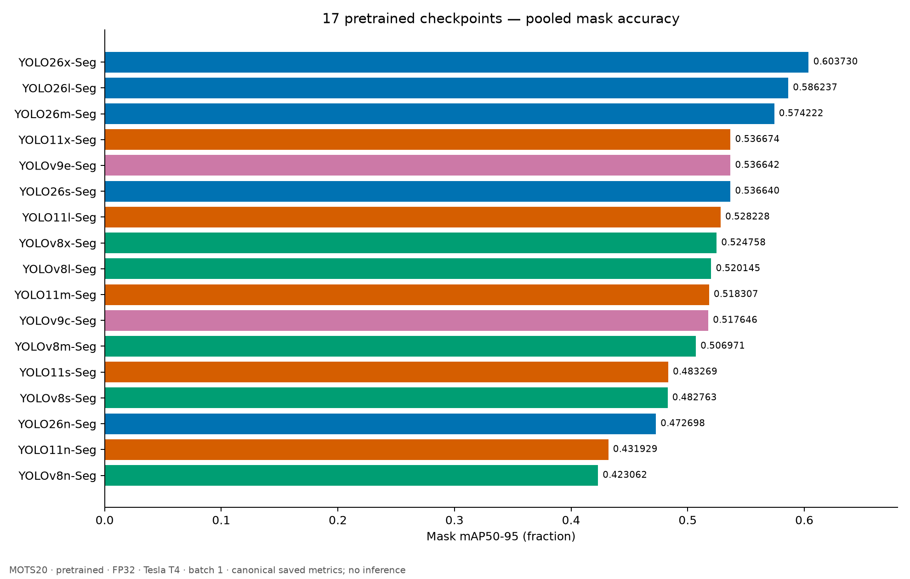
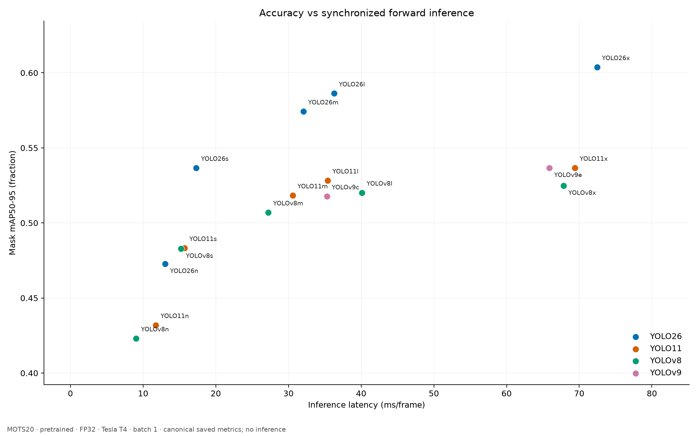
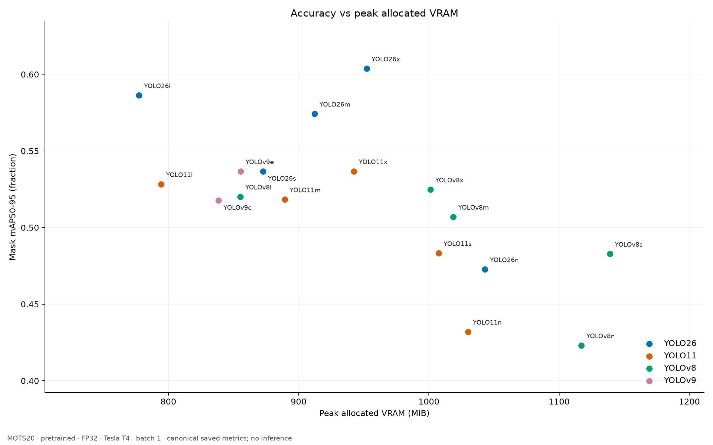

# สรุปภาพรวม YOLO Instance Segmentation Model Scaling

## สรุปใน 1 นาที

- ทดสอบ pretrained segmentation 17 โมเดล ครบ 5 tiers บน MOTS20 2,862 เฟรม และ Person GT 26,894 instances โดยไม่มี fine-tuning
- YOLO26 นำ Mask mAP50-95 และ AP75 ทุก tier; YOLO26x ได้ mAP สูงสุด 0.603730
- YOLOv8n inference เร็วสุด 9.045 ms แต่ pipeline ไม่เร็วสุด
- YOLO26l pipeline เร็วสุด 76.403 ms, FPS สูงสุด 13.089 และ VRAM ต่ำสุด 777.52 MiB
- การลดขนาดทั้ง 13 คู่ทำให้ forward เร็วขึ้น แต่ pipeline เพิ่มใน 8 คู่ และ VRAM เพิ่มใน 7 คู่
- s → n เป็นช่วงที่ mAP ตกมากที่สุดภายใน YOLO26/YOLO11/YOLOv8; ต้องกำหนด accuracy budget ก่อนเลือก
- มี near ties ทั้งใน tier เดียวกันและข้าม tier; ยังไม่มีการทดสอบ statistical significance หรือ CCTV robustness

## 1. ภาพรวมการทดลอง

รวม canonical CSV ของ Largest, Second-largest, Medium, Small และ Nano ภายใต้ config, evaluator, GT, preprocessing และวิธีจับเวลาเดียวกัน ใช้ FP32, imgsz640, batch1, Tesla T4 และเฉพาะ clean timing 3 รอบต่อโมเดล ขั้น Master ไม่เปิด raw predictions และไม่รัน inference ซ้ำ ตัวเลขเต็มอยู่ใน [MASTER_RESULTS.md](MASTER_RESULTS.md) และ [CSV](metrics/MASTER_17_MODELS.csv); วิธีทดลองอยู่ใน [methodology](METHODOLOGY_REFERENCE.md)

## 2. Winner ของแต่ละ Tier

| Tier | mAP | AP75 | Recall | Inference | Pipeline / FPS | VRAM |
| --- | --- | --- | --- | --- | --- | --- |
| Largest (X/E) | YOLO26x-Seg (0.603730) | YOLO26x-Seg (0.664426) | YOLO26x-Seg (0.846285) | YOLOv9e-Seg (65.888) | YOLOv9e-Seg (103.376) | YOLOv9e-Seg (855.41) |
| Second-largest (L/C) | YOLO26l-Seg (0.586237) | YOLO26l-Seg (0.643537) | YOLO26l-Seg (0.834387) | YOLOv9c-Seg (35.293) | YOLO26l-Seg (76.403) | YOLO26l-Seg (777.52) |
| Medium (M) | YOLO26m-Seg (0.574222) | YOLO26m-Seg (0.629038) | YOLO26m-Seg (0.815312) | YOLOv8m-Seg (27.232) | YOLO11m-Seg (76.971) | YOLO11m-Seg (889.38) |
| Small (S) | YOLO26s-Seg (0.536640) | YOLO26s-Seg (0.586796) | YOLO26s-Seg (0.789581) | YOLOv8s-Seg (15.220) | YOLO26s-Seg (78.828) | YOLO26s-Seg (872.67) |
| Nano (N) | YOLO26n-Seg (0.472698) | YOLO26n-Seg (0.506766) | YOLOv8n-Seg (0.696921) | YOLOv8n-Seg (9.045) | YOLO26n-Seg (82.390) | YOLO11n-Seg (1030.00) |

ค่าด้าน accuracy เป็น fraction; เวลาเป็น ms/frame และ VRAM เป็น peak allocated MiB ผู้ชนะ pipeline กับ FPS ตรงกันเพราะ FPS คำนวณจาก pipeline mean

## 3. ภาพรวมทั้ง 17 Models

| Model | Tier | Mask mAP50-95 | AP75 | Recall | Inference ms | Pipeline ms | FPS | VRAM MiB |
| --- | --- | --- | --- | --- | --- | --- | --- | --- |
| YOLO26x-Seg | Largest (X/E) | 0.603730 | 0.664426 | 0.846285 | 72.458 | 109.639 | 9.121 | 952.18 |
| YOLO11x-Seg | Largest (X/E) | 0.536674 | 0.575845 | 0.822228 | 69.406 | 105.885 | 9.444 | 942.48 |
| YOLOv9e-Seg | Largest (X/E) | 0.536642 | 0.572100 | 0.826578 | 65.888 | 103.376 | 9.673 | 855.41 |
| YOLOv8x-Seg | Largest (X/E) | 0.524758 | 0.560452 | 0.814271 | 67.843 | 109.441 | 9.137 | 1001.13 |
| YOLO26l-Seg | Second-largest (L/C) | 0.586237 | 0.643537 | 0.834387 | 36.266 | 76.403 | 13.089 | 777.52 |
| YOLO11l-Seg | Second-largest (L/C) | 0.528228 | 0.565728 | 0.809772 | 35.387 | 76.810 | 13.019 | 794.47 |
| YOLOv9c-Seg | Second-largest (L/C) | 0.517646 | 0.559180 | 0.802930 | 35.293 | 76.921 | 13.000 | 838.49 |
| YOLOv8l-Seg | Second-largest (L/C) | 0.520145 | 0.558149 | 0.809400 | 40.090 | 83.558 | 11.968 | 855.27 |
| YOLO26m-Seg | Medium (M) | 0.574222 | 0.629038 | 0.815312 | 32.043 | 77.309 | 12.935 | 912.16 |
| YOLO11m-Seg | Medium (M) | 0.518307 | 0.557205 | 0.805049 | 30.574 | 76.971 | 12.992 | 889.38 |
| YOLOv8m-Seg | Medium (M) | 0.506971 | 0.542131 | 0.793857 | 27.232 | 78.112 | 12.802 | 1018.76 |
| YOLO26s-Seg | Small (S) | 0.536640 | 0.586796 | 0.789581 | 17.308 | 78.828 | 12.686 | 872.67 |
| YOLO11s-Seg | Small (S) | 0.483269 | 0.513823 | 0.764148 | 15.693 | 88.836 | 11.257 | 1007.50 |
| YOLOv8s-Seg | Small (S) | 0.482763 | 0.506411 | 0.767309 | 15.220 | 92.173 | 10.849 | 1139.01 |
| YOLO26n-Seg | Nano (N) | 0.472698 | 0.506766 | 0.687068 | 13.042 | 82.390 | 12.137 | 1043.13 |
| YOLO11n-Seg | Nano (N) | 0.431929 | 0.450826 | 0.693798 | 11.745 | 97.441 | 10.263 | 1030.00 |
| YOLOv8n-Seg | Nano (N) | 0.423062 | 0.439115 | 0.696921 | 9.045 | 95.683 | 10.451 | 1117.09 |

หน่วยและตัวเลขเพิ่มเติม เช่น AP50, Precision, F1, TP-only quality และ GFLOPs อยู่ใน CSV หลัก ไม่ใช้คะแนนถ่วงน้ำหนักรวมหลายด้าน

## 4. YOLO26 Scaling

| Larger → smaller | ΔmAP pp | ΔInference % | ΔPipeline % | ΔVRAM % | ΔParameters % |
| --- | --- | --- | --- | --- | --- |
| YOLO26x-Seg → YOLO26l-Seg | -1.749 | -49.95 | -30.31 | -18.34 | -55.42 |
| YOLO26l-Seg → YOLO26m-Seg | -1.201 | -11.64 | +1.19 | +17.32 | -13.97 |
| YOLO26m-Seg → YOLO26s-Seg | -3.758 | -45.98 | +1.96 | -4.33 | -57.56 |
| YOLO26s-Seg → YOLO26n-Seg | -6.394 | -24.65 | +4.52 | +19.53 | -72.83 |

**Observation:** ตารางแสดงค่าที่เปลี่ยนเมื่อขยับไป checkpoint ที่เล็กกว่า โดย ΔmAP เป็น percentage points และคอลัมน์ % ใช้ค่ารุ่นใหญ่เป็นฐาน

**Interpretation:** YOLO26x → l แลก accuracy ค่อนข้างน้อยกับ inference ที่ลดประมาณครึ่งหนึ่ง ขณะที่ l → m ทำให้ forward สั้นลง แต่ pipeline และ VRAM สูงขึ้นตามค่าที่วัด ส่วน m → s เหมาะพิจารณาเมื่อ forward budget สำคัญและยอมรับ mAP ที่ลดลงได้

## 5. YOLO11 Scaling

| Larger → smaller | ΔmAP pp | ΔInference % | ΔPipeline % | ΔVRAM % | ΔParameters % |
| --- | --- | --- | --- | --- | --- |
| YOLO11x-Seg → YOLO11l-Seg | -0.845 | -49.01 | -27.46 | -15.70 | -55.46 |
| YOLO11l-Seg → YOLO11m-Seg | -0.992 | -13.60 | +0.21 | +11.95 | -18.99 |
| YOLO11m-Seg → YOLO11s-Seg | -3.504 | -48.67 | +15.41 | +13.28 | -54.89 |
| YOLO11s-Seg → YOLO11n-Seg | -5.134 | -25.16 | +9.69 | +2.23 | -71.55 |

**Observation:** ตารางแสดงค่าที่เปลี่ยนเมื่อขยับไป checkpoint ที่เล็กกว่า โดย ΔmAP เป็น percentage points และคอลัมน์ % ใช้ค่ารุ่นใหญ่เป็นฐาน

**Interpretation:** x → l ลด forward มากโดย mAP ลดน้อยกว่าช่วง m → s และ s → n หลัง l ลงมา pipeline และ VRAM เพิ่มทุกขั้น แม้ parameters ลดลง จึงไม่ควรใช้ชื่อขนาดแทนผลของระบบ

## 6. YOLOv8 Scaling

| Larger → smaller | ΔmAP pp | ΔInference % | ΔPipeline % | ΔVRAM % | ΔParameters % |
| --- | --- | --- | --- | --- | --- |
| YOLOv8x-Seg → YOLOv8l-Seg | -0.461 | -40.91 | -23.65 | -14.57 | -35.96 |
| YOLOv8l-Seg → YOLOv8m-Seg | -1.317 | -32.07 | -6.52 | +19.12 | -40.68 |
| YOLOv8m-Seg → YOLOv8s-Seg | -2.421 | -44.11 | +18.00 | +11.80 | -56.68 |
| YOLOv8s-Seg → YOLOv8n-Seg | -5.970 | -40.57 | +3.81 | -1.92 | -71.15 |

**Observation:** ตารางแสดงค่าที่เปลี่ยนเมื่อขยับไป checkpoint ที่เล็กกว่า โดย ΔmAP เป็น percentage points และคอลัมน์ % ใช้ค่ารุ่นใหญ่เป็นฐาน

**Interpretation:** x → l สูญเสีย mAP น้อยที่สุดใน 13 คู่ แต่ไม่ใช่ accuracy leader ของ tier; l → m ลดทั้ง inference และ pipeline ส่วน m → s และ s → n ทำให้ forward เร็วขึ้นแต่ pipeline ช้าลง

## 7. YOLOv9 Scaling

| Larger → smaller | ΔmAP pp | ΔInference % | ΔPipeline % | ΔVRAM % | ΔParameters % |
| --- | --- | --- | --- | --- | --- |
| YOLOv9e-Seg → YOLOv9c-Seg | -1.900 | -46.43 | -25.59 | -1.98 | -53.90 |

**Observation:** ตารางแสดงค่าที่เปลี่ยนเมื่อขยับไป checkpoint ที่เล็กกว่า โดย ΔmAP เป็น percentage points และคอลัมน์ % ใช้ค่ารุ่นใหญ่เป็นฐาน

**Interpretation:** มีเพียง e และ c ที่เป็น segmentation checkpoints ที่ถูกต้องในชุดนี้ e → c ลดเวลาและ parameters มาก แต่ VRAM ลดเพียงเล็กน้อย จึงห้ามเติมรุ่น m/s/n หรือเปรียบชื่อ e/c ว่า capacity เท่ากับ x/l

## 8. เทียบ Generation ใน Tier เดียวกัน

**Observation:** YOLO26 มี mAP/AP75 สูงสุดทั้งห้า tier แต่ Recall ใน Nano สูงสุดเป็น YOLOv8n การแบ่ง tier ควบคุมกลุ่มขนาดที่มีให้ใช้ ไม่ได้ทำให้จำนวน parameters หรือ pretraining เท่ากัน

**Interpretation:** ใช้ผลเพื่อเลือก checkpoint ในเงื่อนไขนี้ได้ แต่ยังสรุปสาเหตุว่า architecture รุ่นใหม่ดีกว่าเสมอไม่ได้ รวมทั้งไม่ควรเรียกทุกมิติของ Nano ว่า YOLO26 ชนะ

## 9. Accuracy vs Speed

Pareto ด้าน mAP–inference มี YOLO26x-Seg, YOLO26l-Seg, YOLO26m-Seg, YOLO26s-Seg, YOLO11s-Seg, YOLOv8s-Seg, YOLO26n-Seg, YOLO11n-Seg, YOLOv8n-Seg

**Observation:** โมเดลบนเส้น Pareto มีข้อแลกเปลี่ยนต่างกัน; forward เร็วสุดกับ pipeline เร็วสุดเป็นคนละโมเดล

**Interpretation:** ต้องระบุว่าต้องการลดเวลา forward หรือ pipeline ก่อน การเลือกจาก FPS ต้องยอมรับว่าค่านี้ยังไม่รวม decode/RLE/เขียนไฟล์

## 10. Accuracy vs VRAM

Pareto ด้าน mAP–VRAM เหลือ YOLO26x และ YOLO26l โดย YOLO26l ใช้ VRAM ต่ำสุดในทั้ง 17 โมเดล

**Interpretation:** แม้โมเดลเล็กบางรุ่นจะอยู่บน Pareto ของ inference แต่ไม่ได้อยู่บน Pareto ของ allocated VRAM เพราะ peak memory ที่วัดขึ้นกับ runtime workload ด้วย ผลนี้ไม่ใช่ข้อพิสูจน์เชิงสาเหตุของการจัดสรรหน่วยความจำ

## 11. จุดที่ลดขนาดแล้วคุ้ม

คำว่า “คุ้ม” ต่อไปนี้เป็นการตีความตามข้อจำกัด ไม่มีคะแนนรวม: x → l ของ YOLO26/YOLO11/YOLOv8 และ e → c ของ YOLOv9 ลด inference มากโดย mAP ลดไม่เกิน 2 pp ในค่าที่วัด หากยอมรับ accuracy loss ได้ ส่วน YOLO26l เด่นเมื่อให้น้ำหนัก pipeline/VRAM เพราะนำสองด้านนี้ทั้งชุด

YOLO26x → l: ΔmAP -1.749 pp, Δinference -49.95%, ΔVRAM -18.34% รุ่น Small อย่าง YOLO26s เป็นอีกตัวเลือกสำหรับ forward ที่สั้นลง แต่ไม่ใช่ global pipeline/VRAM winner

## 12. จุดที่ Accuracy ตกชัด

**Observation:** s → n ลด mAP -6.394 pp ใน YOLO26, -5.134 pp ใน YOLO11 และ -5.970 pp ใน YOLOv8 ซึ่งเป็น adjacent drop มากที่สุดภายในแต่ละ family

**Interpretation:** การลดรุ่นขั้นสุดท้ายควรเทียบกับค่าความแม่นยำขั้นต่ำที่งานยอมรับได้ คำว่า “ตกชัด” หมายถึงช่องว่างเชิงพรรณนาในค่าที่วัด ไม่ใช่ statistical significance

## 13. Near Ties

ใช้เกณฑ์เชิงพรรณนา |ΔmAP| ≤0.001 หรือ 0.1 pp เพื่อคัดคู่ที่ควรอ่านอย่างระมัดระวัง ไม่ใช่การทดสอบ equivalence

| Model A | Model B | Absolute mAP gap |
| --- | --- | --- |
| YOLO11x-Seg | YOLOv9e-Seg | 0.000031903 |
| YOLO11x-Seg | YOLO26s-Seg | 0.000033907 |
| YOLOv9e-Seg | YOLO26s-Seg | 0.000002005 |
| YOLOv9c-Seg | YOLO11m-Seg | 0.000660396 |
| YOLO11s-Seg | YOLOv8s-Seg | 0.000505355 |

YOLO26s ใกล้ YOLO11x/YOLOv9e มากใน mAP แต่ capacity, latency และ error behavior อาจต่างกัน คู่ข้าม tier ยังไม่ได้ตรวจภาพใหม่ใน Master; ใช้ภาพใน tier เป็นหลักฐานเฉพาะของคู่ที่มีอยู่เท่านั้น

## 14. สิ่งผิดปกติ

- pipeline เพิ่มใน 8/13 ขั้นที่ลดขนาด และ allocated VRAM เพิ่มใน 7/13 ขั้น ทั้งที่ parameters ลดทุกขั้น
- YOLO26l มี pipeline และ VRAM ดีกว่ารุ่นเล็กกว่าทั้งหมดในค่าที่วัด; ความต่างเวลาเล็กน้อยไม่ได้ผ่าน significance test
- YOLO26n ชนะ mAP/AP75 แต่ Recall ต่ำสุดใน Nano; สะท้อนว่าความแม่น mask กับความครบถ้วนตาม fixed threshold เป็นคนละเรื่อง
- postprocessing และ RLE preparation เป็นคนละ stage; RLE ไม่ได้รวมใน FPS และห้ามนำ diagnostic postprocess มาบวกซ้ำ

## 15. ถ้าต้องเลือกโมเดลตามโจทย์

| Priority | Candidate | หลักฐานและเงื่อนไข |
| --- | --- | --- |
| Accuracy | YOLO26x-Seg | mAP 0.603730; inference 72.458 ms |
| Pipeline / Low VRAM | YOLO26l-Seg | pipeline 76.403 ms; VRAM 777.52 MiB; mAP 0.586237 |
| ลดเวลาของ forward โดยยังรักษา mAP | YOLO26s-Seg | inference 17.308 ms; mAP 0.536640; อยู่บน Pareto ด้าน inference |
| Nano ที่เน้น mask accuracy | YOLO26n-Seg | mAP 0.472698; Recall 0.687068 ต่ำสุดใน Nano |
| Inference ต่ำสุด | YOLOv8n-Seg | inference 9.045 ms; mAP 0.423062; pipeline ไม่เร็วสุด |

ทั้งหมดเป็น candidate for later CCTV robustness evaluation โดยมีเงื่อนไขต่างกัน ไม่ใช่คำแนะนำ deployment ขั้นสุดท้าย

## 16. สิ่งที่ผลนี้บอกได้

อันดับและข้อแลกเปลี่ยนของ pretrained checkpoints บน Person masks ใน MOTS20 ภายใต้ protocol เดียวกัน รวมถึงการเปลี่ยนเชิงพรรณนาเมื่อขนาดเล็กลง และชุด nondominated candidates ภายใต้วัตถุประสงค์ที่ระบุ

## 17. สิ่งที่ผลนี้ยังบอกไม่ได้

ความเป็นเหตุจาก architecture, statistical significance, ความเท่ากันของ error patterns, MOTS tracking, ความทนต่อ blur/low light/มุมกล้อง/ระดับ occlusion หรือความพร้อมใช้ CCTV จริง GT เป็น instance รายเฟรม ภาพวิดีโอสัมพันธ์กัน และ TP-only quality ใช้เฉพาะ instances ที่ match ได้

## 18. ขั้นตอนถัดไป

กำหนดชุดข้อมูลและเกณฑ์ CCTV robustness แยกต่างหาก เลือก candidate ตาม accuracy/forward/pipeline/memory budget และวัด deployment pipeline ที่รวมขั้นตอนที่ใช้งานจริง งาน Master นี้หยุดที่ผลสังเคราะห์ ไม่เริ่มการทดลองใหม่

[Executive summary](EXECUTIVE_SUMMARY_TH.md) · [Meeting summary](MEETING_SUMMARY_TH.md) · [Metric guide](METRIC_GUIDE_TH.md) · [Source provenance](provenance/SOURCE_MANIFEST.json)
