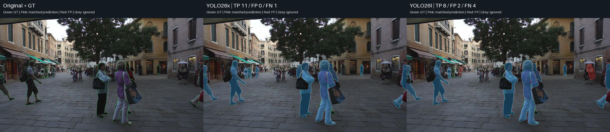
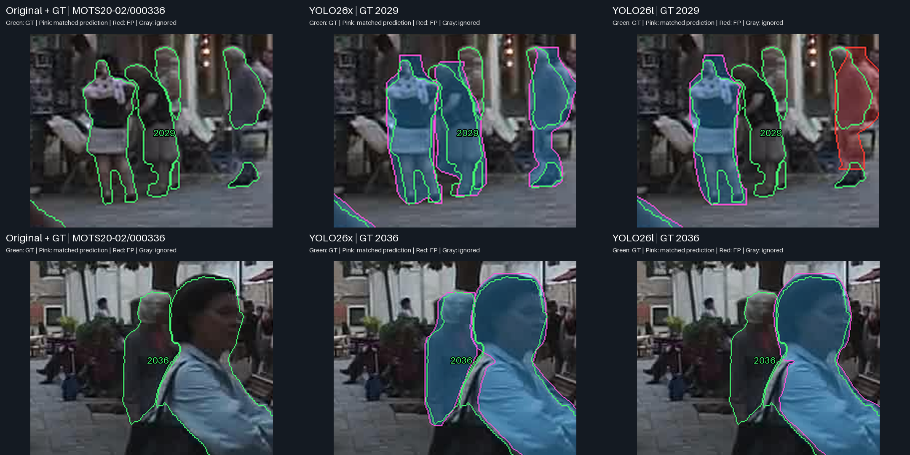
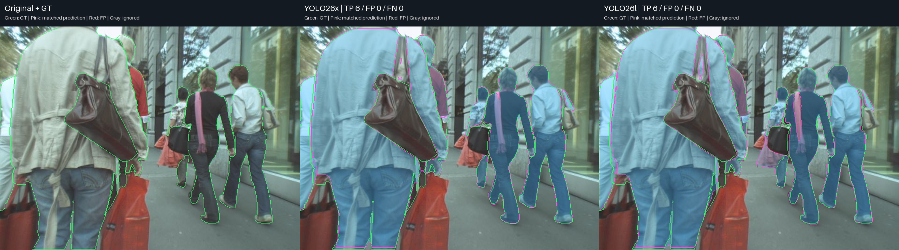
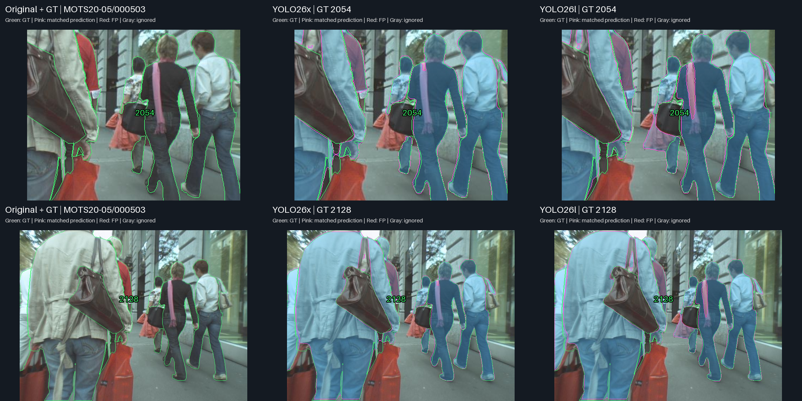
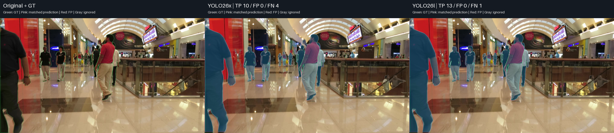
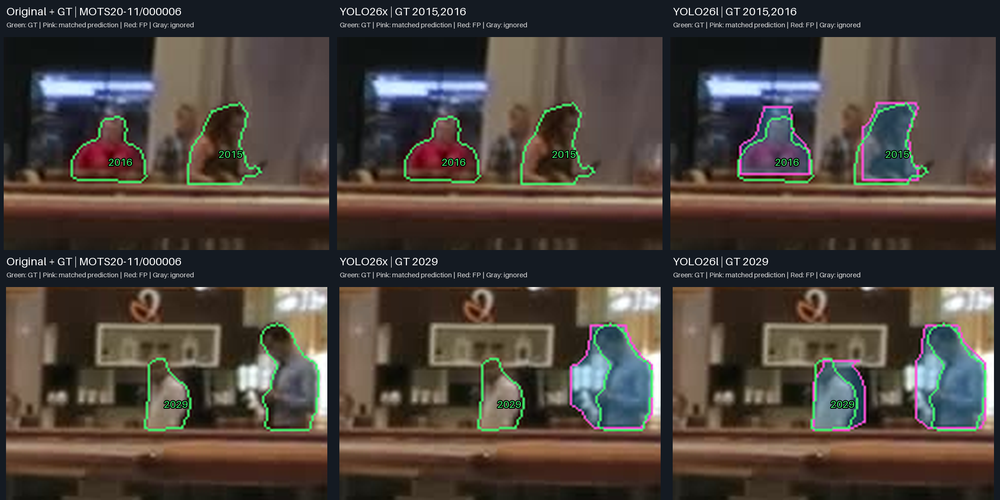
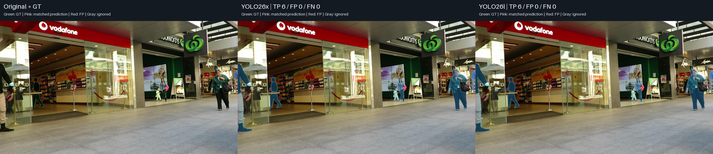
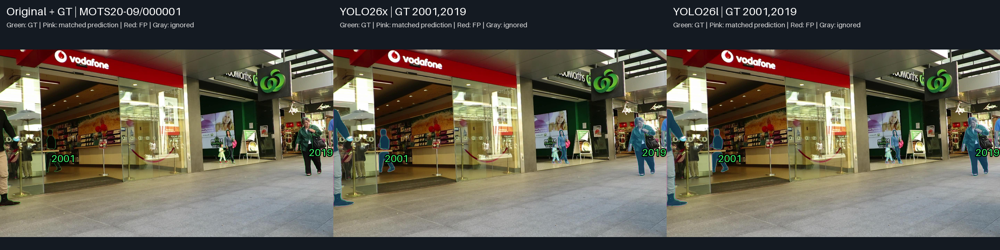
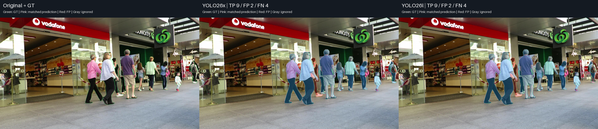
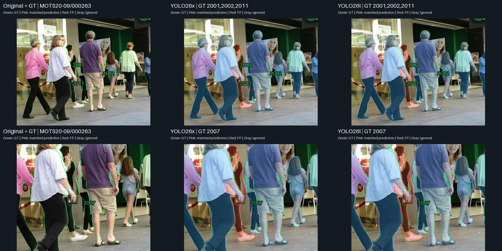

# YOLO26x vs YOLO26l — เปรียบเทียบภาพจริงเพื่อเลือกโมเดล

ใช้ saved lossless predictions จาก benchmark ที่เสร็จแล้วบน original MOTS20 frames ไม่มี inference ใหม่และไม่เปลี่ยนค่าที่วัด ผลนี้เป็นการวิเคราะห์หลัง Master complete ไม่ใช่ benchmark ใหม่

## คำตอบที่ใช้ตัดสินใจได้

**ถ้ายังไม่มีข้อกำหนดว่าต้องเก็บรายละเอียด mask ให้มากที่สุด ผมจะเริ่มประเมิน YOLO26l ก่อน** เพราะผลรวมใกล้ x แต่ inference ประมาณครึ่งหนึ่ง, pipeline เร็วกว่า และ VRAM ต่ำกว่า ถ้าความผิดพลาดแบบ Case 1/2 รับไม่ได้และยอมรับต้นทุนของ x ได้ จึงให้น้ำหนัก YOLO26x มากขึ้น

ภาพจริงไม่ได้ต่างกันมากทุกจุด: ความต่างที่เห็นชัดอยู่ในบาง instances, ความครบถ้วนที่ confidence threshold เดิม และ mask ที่ติดพื้นที่ข้างตัว ตัวอย่างยังมีจุดที่ l ดีกว่า x และข้อผิดพลาดร่วม ทั้งคู่เป็น candidate for later CCTV robustness evaluation ไม่ใช่ข้อสรุป deployment ขั้นสุดท้าย

## ตัวเลขประกอบภาพ

| Metric | YOLO26x | YOLO26l |
| --- | --- | --- |
| Mask mAP50-95 | 0.603730 | 0.586237 |
| AP75 | 0.664426 | 0.643537 |
| Recall | 0.846285 | 0.834387 |
| TP — instances รายเฟรม | 22,760 | 22,440 |
| FP | 1,299 | 1,542 |
| FN | 4,134 | 4,454 |
| TP-only mean IoU | 0.828873 | 0.825340 |
| Inference ms/frame | 72.458 | 36.266 |
| Pipeline ms/frame | 109.639 | 76.403 |
| FPS จาก pipeline | 9.121 | 13.089 |
| Peak allocated VRAM MiB | 952.18 | 777.52 |

x นำ mAP 1.749 percentage points และ Recall 1.190 pp; มี TP มากกว่า 320 และ FP น้อยกว่า 243 ในผลรวม instances รายเฟรม ไม่ใช่จำนวนคนไม่ซ้ำ ส่วน l ใช้ inference ลด 49.95%, pipeline ลด 30.31% และ VRAM ลด 18.34% เทียบ x TP-only IoU ใช้เฉพาะ matched subsets ซึ่งอาจต่างกัน ไม่ควรใช้ส่วนต่างเล็ก ๆ นี้สรุปว่า mask ทุกคนเหมือนกัน

[ข้อมูล Master](metrics/MASTER_17_MODELS.csv) · [Scaling delta](metrics/SCALING_DELTAS.csv)

## ความต่างพบมากน้อยแค่ไหน

ตรวจ TP ต่อเฟรมจาก canonical records ทั้ง 2,862 เฟรม: x มากกว่า l ใน **496 เฟรม**, l มากกว่า x ใน **224 เฟรม**, และจำนวน TP เท่ากัน **2,142 เฟรม** จำนวนเท่ากันไม่ได้รับประกันว่า match GT ชุดเดียวกันหรือ mask เหมือนกัน ตัวเลขนี้เป็น descriptive count ไม่ใช่ significance test และ frames วิดีโอสัมพันธ์กัน

## วิธีอ่านภาพ

ทุกภาพเรียง **Original + GT → YOLO26x → YOLO26l** ใช้เฟรม, ROI coordinates, scale, confidence ≥0.25, mask matching IoU ≥0.50 และ ignore policy เดียวกัน เส้นเขียวเป็น GT, เส้นชมพูเป็น matched prediction, แดงเป็น FP, เทาเป็น ignored prediction ภาพเต็มเก็บไว้ทุก case; ภาพขยายไม่มีรายละเอียดใหม่เพิ่มจาก original pixels

คัด candidate จาก per-frame TP/FP/FN และ TP-only IoU จากนั้นตรวจ 6 เฟรมจริงและเลือก 5 cases มี advantage, counterexample, similar control และ common failure ภาพนี้ถูกเลือกเพื่อวินิจฉัย ไม่ใช่ตัวแทนสุ่มของ dataset ไม่ใช้การทำ ROI เพื่อซ่อน errors อื่น

## Case 1 — คนที่ผ่าน confidence ใน x แต่ไม่ผ่านใน l

**เฟรม:** MOTS20-02 / 000336

**เหตุผลที่เลือก:** เลือกจากเฟรมที่ TP ของ x มากกว่า l ถึง 3 โดยไม่เพิ่ม FP; ภาพขยายเน้น GT 2029 และ 2036 เพื่อเห็นผลของ confidence ที่ใช้จริง

### ภาพเต็ม

### ภาพขยายจุดที่ต่าง

### สิ่งที่เห็นจากภาพ

- x มี TP 11 / FP 0 / FN 1 ขณะที่ l มี TP 8 / FP 2 / FN 4
- GT 2029 และ 2036 มี mask ของ x แสดงอยู่ แต่ l ไม่แสดง mask แยกของสองคนนี้ที่ confidence ≥0.25
- ตรวจ saved predictions แล้ว l มี candidate mask สำหรับ GT 2029 (IoU 0.619, confidence 0.100) และ GT 2036 (IoU 0.851, confidence 0.233) ซึ่งต่ำกว่า threshold; จึงไม่ควรเขียนว่า l ไม่มีความสามารถ segment คนสองคนนี้

### หลักฐานระดับ GT

| GT ID | GT mask area px | YOLO26x | YOLO26l |
| --- | --- | --- | --- |
| 2029 | 2139 | TP IoU 0.636 | FN; best@0.25 0.000 |
| 2036 | 4762 | TP IoU 0.869 | FN; best@0.25 0.005 |

best@0.25 คือ IoU สูงสุดของ candidate ที่ confidence ≥0.25 ไม่ใช่ matched IoU ของ FN ไม่มีการเปลี่ยน count เพื่อให้ตัวอย่างดูดี

### วิเคราะห์

ตัวอย่างนี้แสดงข้อได้เปรียบของ x ที่ operating point เดิม ซึ่งเกี่ยวกับคะแนน confidence ด้วย ไม่ใช่เพียงรูปทรง mask หากงานยอมให้คนที่ confidence ต่ำหายไปไม่ได้ กรณีนี้เป็นเหตุผลให้ตรวจ x เพิ่ม แต่ยังไม่พิสูจน์ว่าลด threshold ของ l แล้วจะมี Recall/Precision ที่ดีกว่าเดิม ต้องประเมิน matching และ FP แยกถ้าจะปรับ threshold

### เชื่อมกับผลเชิงตัวเลข

สอดคล้องในทิศทางกับ Recall รวมของ x ที่สูงกว่า l แต่หนึ่งเฟรมไม่ได้อธิบาย Recall ต่างทั้งหมด

## Case 2 — เจอคนครบเท่ากัน แต่ mask ต่างชัดบริเวณคนและถุงข้างตัว

**เฟรม:** MOTS20-05 / 000503

**เหตุผลที่เลือก:** เลือกจากเฟรมที่ TP/FP/FN เท่ากันและ valid GT ครบทั้งสองโมเดล เพื่อเทียบ mask ของคนเดียวกันโดยไม่ปนความต่างจากคนที่ match ได้

### ภาพเต็ม

### ภาพขยายจุดที่ต่าง

### สิ่งที่เห็นจากภาพ

- ทั้งคู่มี TP 6 / FP 0 / FN 0
- GT 2054 คือคนที่เห็นเพียงบางส่วนด้านซ้ายของคนเสื้อดำ: mask ของ l ต่อเข้าไปในบริเวณถุง/พื้นที่นอกเส้น GT มากกว่า x; IoU ของคนนี้เป็น x 0.853 กับ l 0.593
- GT 2128 ซึ่งเป็นคนใหญ่ทางซ้ายไม่ได้ให้ x ชนะทุกจุด: l มี IoU 0.655 มากกว่า x 0.591; ความต่างจึงขึ้นกับ instance ด้วย

### หลักฐานระดับ GT

| GT ID | GT mask area px | YOLO26x | YOLO26l |
| --- | --- | --- | --- |
| 2054 | 3699 | TP IoU 0.853 | TP IoU 0.593 |
| 2128 | 6240 | TP IoU 0.591 | TP IoU 0.655 |

best@0.25 คือ IoU สูงสุดของ candidate ที่ confidence ≥0.25 ไม่ใช่ matched IoU ของ FN ไม่มีการเปลี่ยน count เพื่อให้ตัวอย่างดูดี

### วิเคราะห์

เคสนี้เป็น pain point ของการเอา mask ไปตัดคนออกจากภาพ: แม้ Recall เท่ากัน แต่พื้นที่ที่ติดมากับ mask ต่างกันมากใน GT 2054 และ IoU ของ x ผ่าน 0.75 ขณะที่ l ไม่ผ่านสำหรับคนนี้ อย่างไรก็ตาม l ทำได้ดีกว่าใน GT 2128 ไม่ควรสรุปว่าขอบของ x ดีกว่าทุกคนจากภาพนี้

### เชื่อมกับผลเชิงตัวเลข

เป็นตัวอย่างของความต่างด้าน mask overlap ที่สอดคล้องกับ AP75 รวมของ x ที่สูงกว่า แต่ AP75 เป็นการประเมินทั้งชุด ไม่ใช่คะแนนจาก ROI นี้

## Case 3 — ตัวอย่างสวนอันดับ — l แสดงคนเพิ่มได้สามคน

**เฟรม:** MOTS20-11 / 000006

**เหตุผลที่เลือก:** เลือก counterexample ที่ l มี TP มากกว่า x ถึง 3 และ FP เท่ากัน เพื่อไม่คัดเฉพาะภาพที่ x ชนะ

### ภาพเต็ม

### ภาพขยายจุดที่ต่าง

### สิ่งที่เห็นจากภาพ

- l มี TP 13 / FP 0 / FN 1 ขณะที่ x มี TP 10 / FP 0 / FN 4
- ในภาพขยาย l แสดง mask ของ GT 2015/2016 หลังเคาน์เตอร์ และ GT 2029 ทางขวา ขณะที่ x ไม่แสดงที่ confidence ≥0.25
- x มี candidate mask ของสามคนนี้อยู่ใน saved predictions แต่ confidence ประมาณ 0.121/0.171/0.203 ต่ำกว่า 0.25; best candidate IoU เป็น 0.822/0.653/0.827 ตามลำดับ

### หลักฐานระดับ GT

| GT ID | GT mask area px | YOLO26x | YOLO26l |
| --- | --- | --- | --- |
| 2015 | 1022 | FN; best@0.25 0.000 | TP IoU 0.775 |
| 2016 | 874 | FN; best@0.25 0.000 | TP IoU 0.686 |
| 2029 | 651 | FN; best@0.25 0.000 | TP IoU 0.683 |

best@0.25 คือ IoU สูงสุดของ candidate ที่ confidence ≥0.25 ไม่ใช่ matched IoU ของ FN ไม่มีการเปลี่ยน count เพื่อให้ตัวอย่างดูดี

### วิเคราะห์

ความแม่นยำรวมที่สูงกว่าไม่ได้รับประกันว่า x จะได้ TP มากกว่าทุกเฟรม ตัวอย่างนี้แสดงว่า confidence ของแต่ละ checkpoint อาจให้ผลต่างกันที่ threshold เดียวกัน โดยมีคนที่ l นำ mask มาใช้ได้แต่ x ยังไม่ผ่าน threshold

### เชื่อมกับผลเชิงตัวเลข

ไม่ขัดกับ mAP รวมของ x ที่สูงกว่า เพราะ mAP ใช้ confidence ranking จาก floor 0.001 และหลาย IoU thresholds ส่วน TP/FN ในภาพใช้ confidence 0.25 กับ matching IoU 0.50

## Case 4 — ตัวควบคุม — คนครบเท่ากันและภาพใกล้เคียงกัน

**เฟรม:** MOTS20-09 / 000001

**เหตุผลที่เลือก:** เลือกภาพที่ valid GT ครบทั้งคู่เพื่อให้เห็นกรณีที่ผู้ใช้แทบไม่เห็นประโยชน์เพิ่มจาก x ในภาพรวม

### ภาพเต็ม

### ภาพขยายจุดที่ต่าง

### สิ่งที่เห็นจากภาพ

- ทั้งคู่ TP 6 / FP 0 / FN 0; GT ที่ match ได้ครบเป็นชุดเดียวกัน
- ตำแหน่งและรูปทรงของคนหลักในภาพใกล้กัน โดย GT 2001 มี IoU x 0.791 / l 0.784 และ GT 2019 มี x 0.895 / l 0.880
- ignored predictions ต่างกัน 2 กับ 1 และไม่ได้ถูกนับเป็น FP

### หลักฐานระดับ GT

| GT ID | GT mask area px | YOLO26x | YOLO26l |
| --- | --- | --- | --- |
| 2001 | 9977 | TP IoU 0.791 | TP IoU 0.784 |
| 2019 | 28464 | TP IoU 0.895 | TP IoU 0.880 |

best@0.25 คือ IoU สูงสุดของ candidate ที่ confidence ≥0.25 ไม่ใช่ matched IoU ของ FN ไม่มีการเปลี่ยน count เพื่อให้ตัวอย่างดูดี

### วิเคราะห์

ในภาพลักษณะนี้การเพิ่มขนาดอาจให้ผลที่เห็นเพิ่มเพียงเล็กน้อย หากงานเน้น throughput และผลของ l เพียงพอ กรณีนี้สนับสนุนให้พิจารณา l แต่ไม่ใช่หลักฐานว่าทั้งคู่เท่ากันทุกภาพ

### เชื่อมกับผลเชิงตัวเลข

เป็นตัวอย่างประกอบช่องว่าง mAP รวมที่มีขนาดจำกัด ไม่ใช่หลักฐานของ statistical equivalence

## Case 5 — ความล้มเหลวร่วม — mask ที่มีอยู่ยังจับคู่ GT ไม่ผ่าน

**เฟรม:** MOTS20-09 / 000263

**เหตุผลที่เลือก:** เลือก shared failure anchor เพื่อแสดงข้อจำกัดที่เปลี่ยนจาก l ไป x ก็ยังไม่แก้ในตัวอย่างนี้

### ภาพเต็ม

### ภาพขยายจุดที่ต่าง

### สิ่งที่เห็นจากภาพ

- ทั้งคู่ TP 9 / FP 2 / FN 4
- GT 2001/2002/2011 ไม่ผ่าน matching ในทั้งสองโมเดล และ mask สีแดงทับบริเวณคนจริง; FP จึงไม่จำเป็นต้องเป็นคนที่ไม่มีจริง
- GT 2011 มี best candidate IoU ที่ confidence ≥0.25 เพียง x 0.395 / l 0.366 ต่ำกว่าเกณฑ์ 0.50; แม้มี mask อยู่ก็ยังเป็น FN ของ GT และ FP ของ prediction

### หลักฐานระดับ GT

| GT ID | GT mask area px | YOLO26x | YOLO26l |
| --- | --- | --- | --- |
| 2001 | 4220 | FN; best@0.25 0.269 | FN; best@0.25 0.243 |
| 2002 | 902 | FN; best@0.25 0.010 | FN; best@0.25 0.010 |
| 2007 | 8146 | TP IoU 0.683 | TP IoU 0.631 |
| 2011 | 7989 | FN; best@0.25 0.395 | FN; best@0.25 0.366 |

best@0.25 คือ IoU สูงสุดของ candidate ที่ confidence ≥0.25 ไม่ใช่ matched IoU ของ FN ไม่มีการเปลี่ยน count เพื่อให้ตัวอย่างดูดี

### วิเคราะห์

หากปัญหาหลักเป็นการแยก instances ในบริเวณคนซ้อนกัน การเพิ่มขนาดอย่างเดียวไม่ได้รับประกันว่าปัญหาจะหาย เคสนี้จึงเป็นข้อจำกัดที่ควรถือไปทดสอบต่อทั้งสองรุ่น

### เชื่อมกับผลเชิงตัวเลข

ช่วยอ่านความหมายของ Recall/AP ที่ไม่สมบูรณ์ แต่ไม่ใช้ภาพเดียวประมาณอัตราความล้มเหลวทั้ง dataset

## Failure Analysis

| Failure pattern | Models observed | Case | ความหมายสำหรับการเลือก |
|---|---|---|---|
| Candidate confidence ต่ำกว่า 0.25 | l ใน Case 1; x ใน Case 3 | 1, 3 | FN ที่ operating point เดิม ไม่ใช่หลักฐานว่าไม่มี candidate mask เลย |
| พื้นที่ mask เกิน GT รอบ instance | l เด่นใน GT 2054; อีก instance ให้ l IoU ดีกว่า | 2 | ความครบถ้วนเท่ากันยังให้ผล cutout ต่างกันได้ |
| Mask overlap ไม่ผ่าน matching threshold | x และ l | 5 | FP/FN อาจอยู่บนคนจริง ไม่ใช่ background hallucination เสมอ |
| Instance ที่ไม่ผ่าน matching ในบริเวณคนซ้อนกัน | x และ l | 5 | เพิ่มขนาดยังไม่แก้ทุกข้อผิดพลาด |

## สิ่งที่เรียนรู้จากภาพจริง

1. **Observation:** Case 1 ให้ x เก็บคนที่ผ่าน threshold ได้เพิ่ม แต่ Case 3 เป็น l ที่ได้เพิ่ม **Interpretation:** confidence behavior ต่างกันและผู้ชนะ Recall รวมไม่ได้ชนะทุกเฟรม
2. **Observation:** Case 2 ตรวจคนครบเท่ากัน แต่ GT 2054 ให้ mask overlap ต่างมาก **Interpretation:** ถ้างานใช้ mask ไปตัดคนออก พื้นที่นอก GT เป็นเกณฑ์ตัดสินที่สำคัญกว่า count อย่างเดียว
3. **Observation:** ใน Case 4 รูปทรงและความครบถ้วนของคนหลักใกล้กัน **Interpretation:** บางภาพไม่แสดงประโยชน์ที่เห็นชัดจากต้นทุนเพิ่มของ x
4. **Observation:** ทั้งคู่ผิดใน Case 5 **Interpretation:** ต้องตรวจ failure ที่ยอมรับได้ก่อนเลือก ไม่เลือก x เพียงเพราะคาดว่าขนาดใหญ่จะลบ pain point ทุกอย่าง

## ถ้าต้องเลือกจากผลนี้

| Priority | Candidate | Evidence |
|---|---|---|
| Accuracy/คุณภาพ mask มีน้ำหนักสูง และยอมเพิ่มเวลาได้ | YOLO26x | นำ mAP/AP75/Recall รวม; Case 1/2 แสดงข้อได้เปรียบบาง instances พร้อมมี counterexample |
| Pipeline/VRAM สำคัญและผลของ l เพียงพอ | YOLO26l | latency/memory benchmark ดีกว่า x; Case 3/4 แสดงว่าบางภาพ l ไม่เสียผลที่เห็นชัดหรือเก็บได้มากกว่า |
| Confidence operating point เป็นข้อจำกัด | ยังเลือกจากภาพเดียวไม่ได้ | Case 1/3 มี candidates ต่ำกว่า threshold; หากจะเปลี่ยน confidence ต้องประเมิน matching, FP และ Recall ใหม่อย่างเป็นระบบ |

## ข้อจำกัด

ชุดภาพนี้คัดแบบ diagnostic และมี extreme count examples ไม่ใช่หลักฐานความถี่ทั่วไปของ mask errors เฟรมเดียวไม่พิสูจน์ผลทั้ง dataset ไม่แทน mAP/Recall รวม หรือ statistical significance TP counts ที่เท่ากันไม่ได้หมายถึง outputs เท่ากัน

Candidate IoU จาก predictions ต่ำกว่า threshold เป็น diagnostic overlap เท่านั้น ไม่รับประกันว่าจะกลายเป็น TP หากลด confidence เพราะยังต้องจับคู่ one-to-one และใช้ ignore policy ห้ามนำภาพเหล่านี้ไปตั้ง threshold ใหม่แล้วอ้างผล canonical เดิม ไม่มีการปรับ threshold หรือ inference ในงานนี้

Latency/VRAM อ่านจาก benchmark ไม่อนุมานจากภาพ Pipeline FPS ไม่รวม decode/RLE/เขียนผล MOTS20 ไม่ยืนยัน CCTV robustness และ TP เป็น instances รายเฟรม ไม่ใช่คนไม่ซ้ำ

[Evidence + ROI coordinates + source hashes](outputs/visualizations/yolo26x_vs_yolo26l/v1/EVIDENCE.json) · [Master results](MASTER_RESULTS.md) · [Gallery แบบเปิดใน browser](reports/yolo26x_vs_yolo26l.html)
