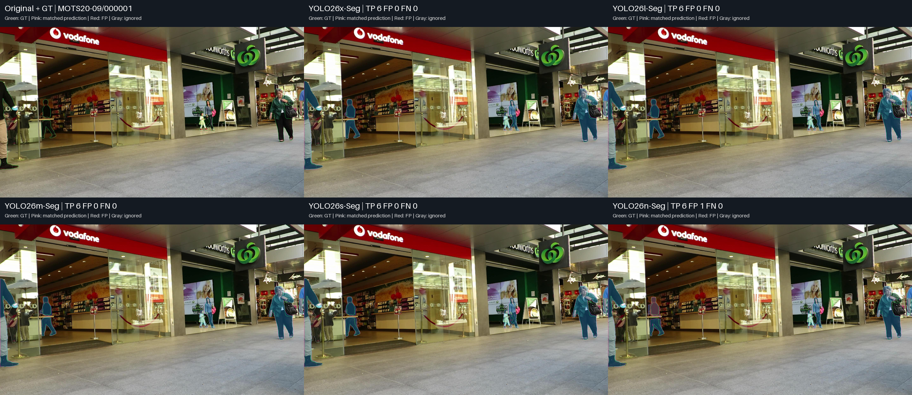
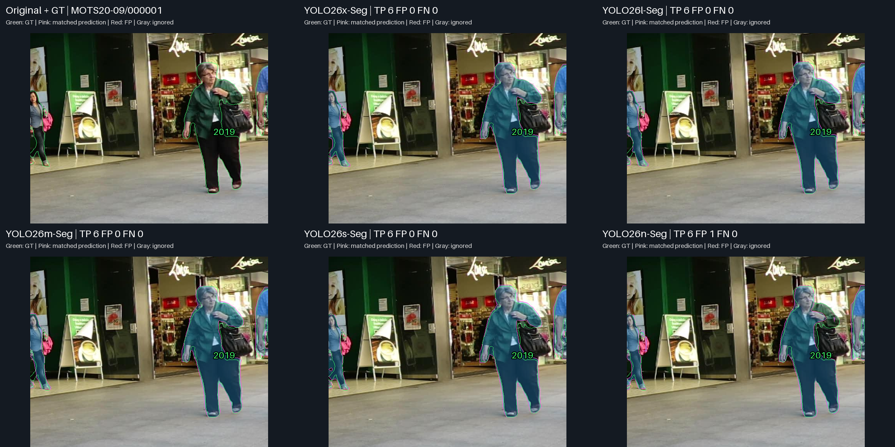
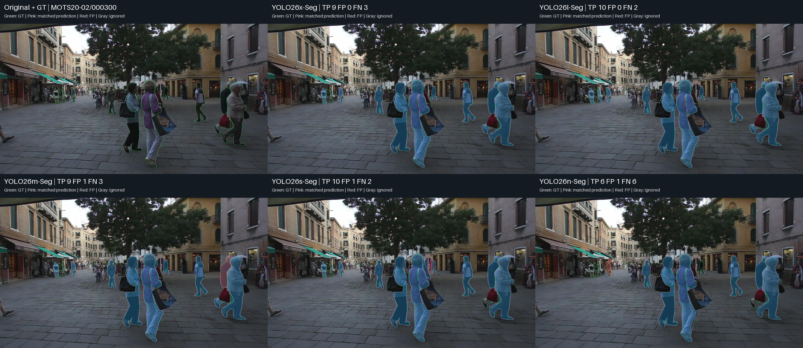
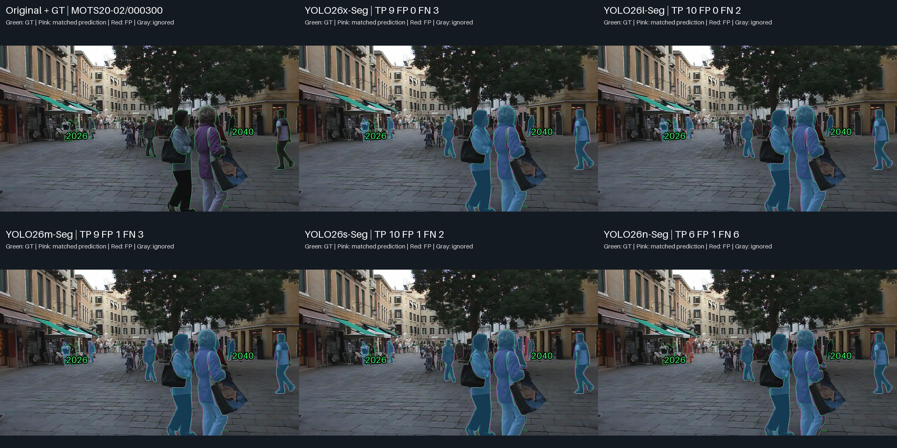
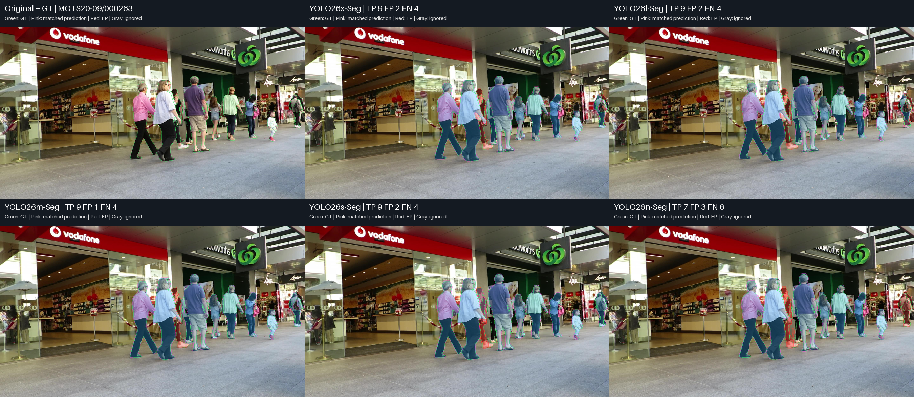
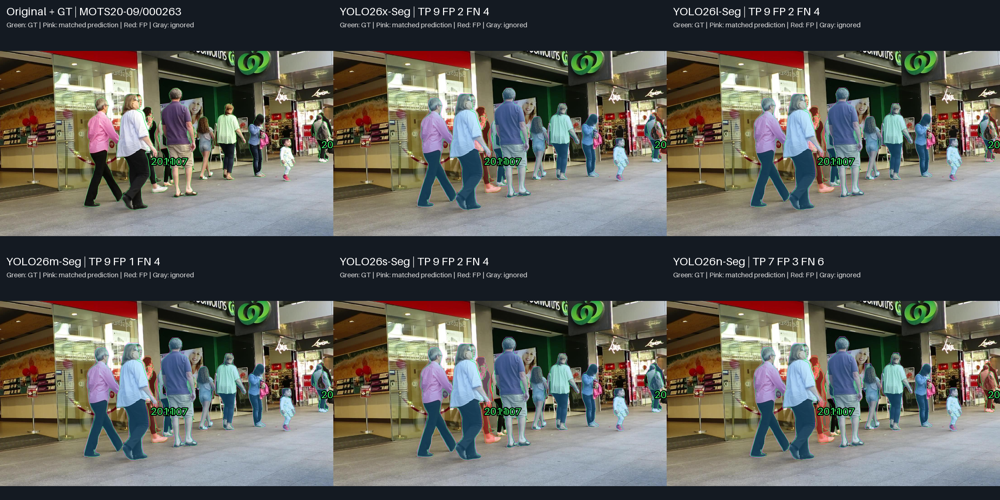

# YOLO26 x → n — Same-Frame Scaling Visual Analysis

**สถานะ: diagnostic qualitative analysis จาก saved predictions เท่านั้น; ไม่มี inference หรือ benchmark ใหม่**

## ภาพรวมและวิธีอ่านหลักฐาน

ใช้ original MOTS20/GT และ saved lossless RLE จาก benchmark ที่เสร็จแล้ว ทุก panel ใน case ใช้เฟรมเดียวกัน confidence ≥0.25, one-to-one mask matching IoU ≥0.50 และ ignore IoA ≥0.50 ตาม policy เดิม สีเขียวเป็น GT, สีชมพูเป็น matched prediction, สีแดงเป็น FP และสีเทาเป็น ignored prediction ซึ่งไม่ถูกนับ FP

Panel เรียงซ้ายไปขวา: Original/GT, x, l ในแถวแรก; m, s, n ในแถวที่สอง

Full-frame อยู่ทุก case และ ROI เป็นภาพเสริมที่ใช้พิกัด/scale เดียวกันทุกโมเดล การขยายไม่เพิ่มรายละเอียดต้นฉบับ TP/FP/FN ด้านล่างเป็น counts ของเต็มเฟรม ไม่ใช่เฉพาะ ROI FN อาจมี prediction อยู่แล้วแต่ไม่ผ่าน confidence/matching; FP เป็น unmatched prediction ไม่จำเป็นต้องเป็นคนที่ไม่มีจริง

เลือกจาก existing diagnostic pool และ per-frame CSV ให้มี control, ความต่าง, counterexample และ common failure ไม่ใช่ representative sample หรือ full-dataset extrema เฟรมที่ซ้ำกับรายงาน tier/รายงานอื่นไม่เพิ่มจำนวน independent samples

[Case selection](outputs/visualizations/yolo26_scaling_ladder/v1/CASE_SELECTION.md) · [Evidence, source hashes and ROI](outputs/visualizations/yolo26_scaling_ladder/v1/EVIDENCE.json)

## Case 1 — Coverage คล้ายกัน ไม่ได้แปลว่า mask ทุกขนาดเหมือนกัน

**เฟรม:** MOTS20-09 / 000001

**เหตุผลที่เลือก:** similar coverage control

### ภาพเปรียบเทียบ

### ภาพขยาย

ROI xyxy: `[1306, 314, 1920, 806]`; ภาพเต็มด้านบนยังคงแสดง error นอก ROI

### สิ่งที่เห็นจากภาพ

- ทุกขนาด match valid GT ครบ 6 instances; x/l/m/s ไม่มี FP ส่วน n มี FP หนึ่ง mask ที่ทับบางส่วนของ GT 2001 ซึ่งมีคู่แล้ว
- ROI ของคนเสื้อเขียว GT 2019 มี matched mask ทุกโมเดล รูปทรงหลักคล้ายกัน; IoU x/l/m/s/n เป็น 0.895/0.880/0.886/0.877/0.821

| Model | TP | FP | FN |
|---|---:|---:|---:|
| YOLO26x-Seg | 6 | 0 | 0 |
| YOLO26l-Seg | 6 | 0 | 0 |
| YOLO26m-Seg | 6 | 0 | 0 |
| YOLO26s-Seg | 6 | 0 | 0 |
| YOLO26n-Seg | 6 | 1 | 0 |

GT-level diagnostics จาก saved masks; TP เป็น matched IoU ส่วน FN เป็น best candidate IoU ที่ confidence เดิม:

| GT | YOLO26x-Seg | YOLO26l-Seg | YOLO26m-Seg | YOLO26s-Seg | YOLO26n-Seg |
|---|---|---|---|---|---|
| 2019 | TP IoU 0.895 | TP IoU 0.880 | TP IoU 0.886 | TP IoU 0.877 | TP IoU 0.821 |

### วิเคราะห์

เป็น control ที่แสดงว่าการลดขนาดไม่จำเป็นต้องเสีย coverage ในทุกภาพ และ mask ของคนหลักยังใกล้กัน ขณะเดียวกัน IoU ของ m สูงกว่า l ใน GT นี้ จึงไม่ใช่คุณภาพต่อคนที่ลดลงแบบ monotonic ทุกครั้ง Extra mask ของ n อยู่คนละบริเวณกับ ROI ต้องตรวจภาพเต็มควบคู่

### เชื่อมกับผลเชิงตัวเลข

สอดคล้องกับ TP-only overlap ที่ยังค่อนข้างใกล้กันในหลายขนาด แต่ TP-only means ใช้ matched subsets ต่างกัน; ภาพนี้ไม่ยืนยันว่าขนาดต่างกันให้ output เหมือนกันทั้ง dataset

### ขอบเขตของหลักฐาน

ผลเฉพาะเฟรมนี้ไม่แทน dataset-level metrics หรือความถี่ของ failure Candidate IoU ต่ำกว่า threshold เป็น diagnostic overlap ไม่รับประกันว่าจะกลายเป็น TP หากเปลี่ยน confidence และยังต้องใช้ one-to-one/ignore policy เดิม

## Case 2 — Nano พลาดคนเพิ่ม แต่ l/s มี coverage มากกว่า x ในเฟรมเดียวกัน

**เฟรม:** MOTS20-02 / 000300

**เหตุผลที่เลือก:** scaling degradation with l/s coverage counterexample

### ภาพเปรียบเทียบ

### ภาพขยาย

ROI xyxy: `[90, 118, 1508, 906]`; ภาพเต็มด้านบนยังคงแสดง error นอก ROI

### สิ่งที่เห็นจากภาพ

- x/l/m/s/n มี TP 9/10/9/10/6 และ FP 0/0/1/1/1 ตามลำดับ
- GT 2026 ฝั่งซ้ายและ GT 2040 หลังคนใหญ่กลางภาพ match ใน x/l/m/s แต่ไม่ match ใน n ที่ confidence เดิม
- l เก็บ GT 2028 ซึ่ง x/m พลาด; s เก็บ GT 2003 ซึ่ง x/l/m พลาด แต่ s ยังพลาด 2028 และมี FP ทับบางส่วนของ GT 2040 ที่มีคู่แล้ว

| Model | TP | FP | FN |
|---|---:|---:|---:|
| YOLO26x-Seg | 9 | 0 | 3 |
| YOLO26l-Seg | 10 | 0 | 2 |
| YOLO26m-Seg | 9 | 1 | 3 |
| YOLO26s-Seg | 10 | 1 | 2 |
| YOLO26n-Seg | 6 | 1 | 6 |

GT-level diagnostics จาก saved masks; TP เป็น matched IoU ส่วน FN เป็น best candidate IoU ที่ confidence เดิม:

| GT | YOLO26x-Seg | YOLO26l-Seg | YOLO26m-Seg | YOLO26s-Seg | YOLO26n-Seg |
|---|---|---|---|---|---|
| 2026 | TP IoU 0.776 | TP IoU 0.758 | TP IoU 0.754 | TP IoU 0.757 | FN; best IoU 0.000 |
| 2040 | TP IoU 0.800 | TP IoU 0.787 | TP IoU 0.647 | TP IoU 0.620 | FN; best IoU 0.000 |

### วิเคราะห์

ตัวอย่างแสดงทั้ง degradation ของ n และ counterexample ต่อการใช้ขนาดตัดสินทุกเฟรม Coverage มากขึ้นของ s ไม่ได้มาพร้อม output ส่วนเกินที่น้อยกว่าเสมอ FP ของ m ทับ GT 2037 ที่มีคู่แล้ว ส่วน n มี unmatched mask ทับ GT 2027 โดย IoU ประมาณ 0.481 ต่ำกว่าเกณฑ์ ไม่เรียกว่า nonexistent person โดยอัตโนมัติ

### เชื่อมกับผลเชิงตัวเลข

สอดคล้องในทิศทางกับ Recall ที่ลดเมื่อ s → n แต่ไม่อธิบายช่องว่างรวมจากเฟรมเดียว การที่ l/s มี TP มากกว่า x ในเฟรมนี้ไม่ขัดกับ pooled mAP/Recall ของ x ที่สูงกว่า

### ขอบเขตของหลักฐาน

ผลเฉพาะเฟรมนี้ไม่แทน dataset-level metrics หรือความถี่ของ failure Candidate IoU ต่ำกว่า threshold เป็น diagnostic overlap ไม่รับประกันว่าจะกลายเป็น TP หากเปลี่ยน confidence และยังต้องใช้ one-to-one/ignore policy เดิม

## Case 3 — ข้อผิดพลาดร่วม และ TP เท่ากันแต่เก็บ GT ต่างชุด

**เฟรม:** MOTS20-09 / 000263

**เหตุผลที่เลือก:** common failure and Nano matching loss

### ภาพเปรียบเทียบ

### ภาพขยาย

ROI xyxy: `[450, 144, 1920, 961]`; ภาพเต็มด้านบนยังคงแสดง error นอก ROI

### สิ่งที่เห็นจากภาพ

- x/l/m/s มี TP 9 และ FN 4 ส่วน n มี TP 7 และ FN 6; FP เป็น 2/2/1/2/3
- GT 2011 ไม่ match ทุกขนาด แม้มี prediction ในบริเวณคนจริง; best candidate IoU ที่ confidence ≥0.25 ยังต่ำกว่า 0.50
- GT 2007 match ใน x/l/m แต่ไม่ match ใน s/n; s เก็บ GT 2001 ที่ x/l/m ไม่ match จึงได้ TP เท่ากันจาก GT คนละชุด
- GT 2018 match ใน x/l/m/s แต่ n มี best candidate IoU ประมาณ 0.452 และยังเป็น FN

| Model | TP | FP | FN |
|---|---:|---:|---:|
| YOLO26x-Seg | 9 | 2 | 4 |
| YOLO26l-Seg | 9 | 2 | 4 |
| YOLO26m-Seg | 9 | 1 | 4 |
| YOLO26s-Seg | 9 | 2 | 4 |
| YOLO26n-Seg | 7 | 3 | 6 |

GT-level diagnostics จาก saved masks; TP เป็น matched IoU ส่วน FN เป็น best candidate IoU ที่ confidence เดิม:

| GT | YOLO26x-Seg | YOLO26l-Seg | YOLO26m-Seg | YOLO26s-Seg | YOLO26n-Seg |
|---|---|---|---|---|---|
| 2007 | TP IoU 0.683 | TP IoU 0.631 | TP IoU 0.727 | FN; best IoU 0.054 | FN; best IoU 0.053 |
| 2011 | FN; best IoU 0.395 | FN; best IoU 0.366 | FN; best IoU 0.391 | FN; best IoU 0.404 | FN; best IoU 0.328 |
| 2018 | TP IoU 0.585 | TP IoU 0.627 | TP IoU 0.572 | TP IoU 0.515 | FN; best IoU 0.452 |

### วิเคราะห์

การดูจำนวน TP รวมปิดบังว่าใครถูกเก็บหรือพลาด ภาพแสดง mask บนบริเวณคนจริงที่ไม่ผ่าน matching พร้อม common failure ของทุกขนาด จึงไม่ใช่เพียงโมเดลใหญ่แก้ปัญหาได้ทั้งหมด และไม่อนุมาน severity หรือสาเหตุเชิง architecture

### เชื่อมกับผลเชิงตัวเลข

ตัวอย่างนี้ช่วยตีความ coverage และ overlap แยกกัน แต่ไม่ได้อธิบาย dataset-wide AP75/Recall หรือความถี่ของ failure และไม่ได้ใช้ภาพอนุมาน latency/VRAM

### ขอบเขตของหลักฐาน

ผลเฉพาะเฟรมนี้ไม่แทน dataset-level metrics หรือความถี่ของ failure Candidate IoU ต่ำกว่า threshold เป็น diagnostic overlap ไม่รับประกันว่าจะกลายเป็น TP หากเปลี่ยน confidence และยังต้องใช้ one-to-one/ignore policy เดิม

## Failure Analysis

| Failure pattern | Models observed | Case | Interpretation |
|---|---|---|---|
| Extra mask บน GT ที่มีคู่แล้ว | n; m/s | 1/2 | counts และ matched GT ไม่แทนจำนวน outputs |
| GT ไม่ผ่าน matching เมื่อขนาดเล็กลง | n; s/n | 2/3 | ข้อได้เปรียบของขนาดใหญ่มี counterexample ด้วย |
| Mask บนคนจริงแต่ IoU ไม่ผ่าน | ทุกขนาด | 3 | FP/FN อาจเกิดบริเวณเดียวกัน |

## สิ่งที่เรียนรู้จากภาพจริง

**Observation:** มี control ที่ coverage เท่ากัน แต่กรณีอื่นมีทั้ง GT ชุดต่างกันและ extra outputs ต่างกัน

**Interpretation:** การเลือกต้องดูชนิดและตำแหน่งของ error ร่วมกับ pooled metrics ไม่สรุปจาก counts หรือภาพคนใหญ่เพียงอย่างเดียว

**Observation:** ตัวอย่างมีทั้งผลที่สอดคล้องและสวนอันดับรวม รวมถึง common failures

**Interpretation:** ขนาด/คะแนนรวมไม่รับรองคุณภาพต่อ GT ทุกคน และกรณีที่เลือกไม่วัดความถี่หรือ causal architecture effect

## เมื่อดูทั้งตัวเลขและภาพร่วมกัน

YOLO26 pooled mAP/Recall ลดลงเมื่อ x → n แต่ Case 2 ให้ l/s มี TP มากกว่า x และ Case 3 ให้ TP เท่ากันจาก GT คนละชุด จึงไม่ใช้คำว่า mask ทุกคนลดคุณภาพตามขนาดแบบ monotonic TP-only IoU/Dice ใช้ matched subsets ที่อาจต่างกัน

Latency และ VRAM เป็น system measurements จาก benchmark ภาพ segmentation ไม่วัดสองค่านี้ Pipeline FPS ไม่รวม decode, RLE preparation และการเขียนผล

## ใช้ประกอบการเลือกอย่างไร

หากเน้นความครบถ้วน ให้ตรวจ GT coverage และ Recall รวม หากเน้น mask extraction ให้ตรวจ foreground loss/พื้นที่ติดเกินและ diagnostics ของคนเดียวกัน ส่วนข้อจำกัด speed/memory อ่านจาก CSV ภาพเหล่านี้ไม่ประกาศผู้ชนะทุกด้านหรือ final CCTV superiority

## ข้อจำกัด

- เฟรมที่เลือกเป็น diagnostic examples ไม่ใช่ random representative sample และเฟรมวิดีโอสัมพันธ์กัน
- Overlay และภาพย่ออาจซ่อนรายละเอียดพิกเซล; ค่าราย GT ช่วยตรวจ overlap ไม่ใช่ boundary metric โดยตรง
- ไม่มี statistical significance/equivalence test หรือการวัด tracking
- ไม่อนุมาน blur/low-light/มุมกล้อง/occlusion robustness หรือ deployment readiness
- Capacity/checkpoints/pretraining ต่างกันใน cross-generation comparison; ไม่พิสูจน์ architecture causality

## รายละเอียดเพิ่มเติม

[Canonical results](metrics/MASTER_17_MODELS.csv) · [Research insights](RESEARCH_INSIGHTS_TH.md) · [Technical record](MASTER_RESULTS.md) · [x/l visual study](YOLO26X_VS_YOLO26L_VISUAL_TH.md)
